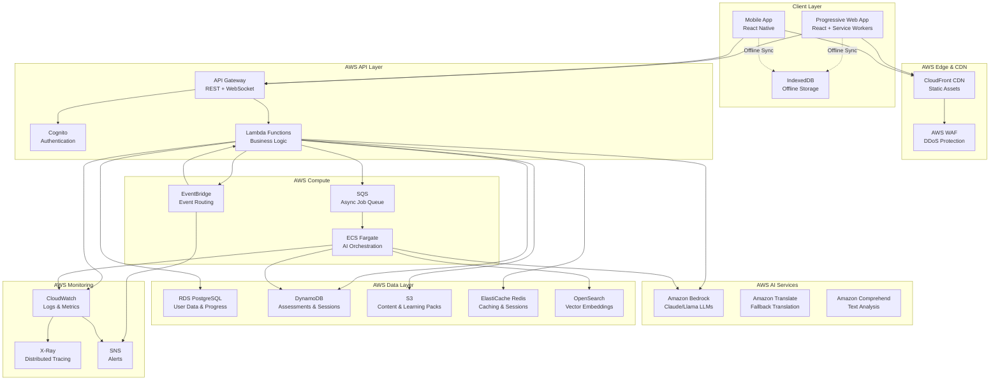
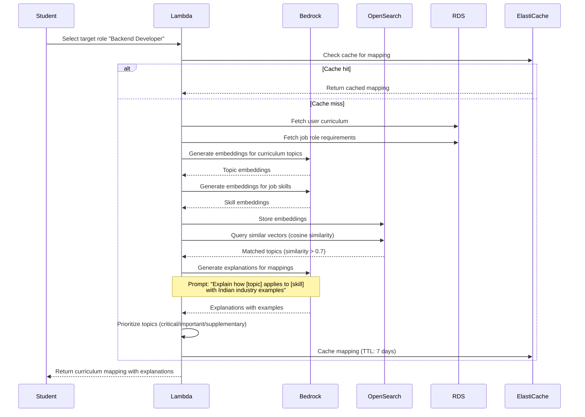
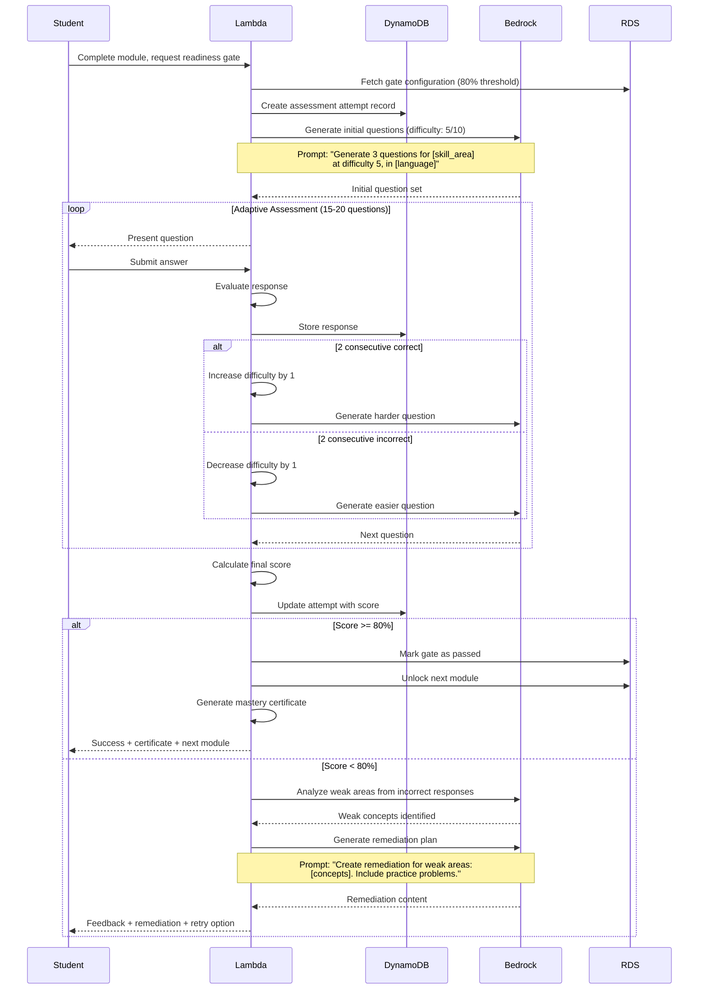
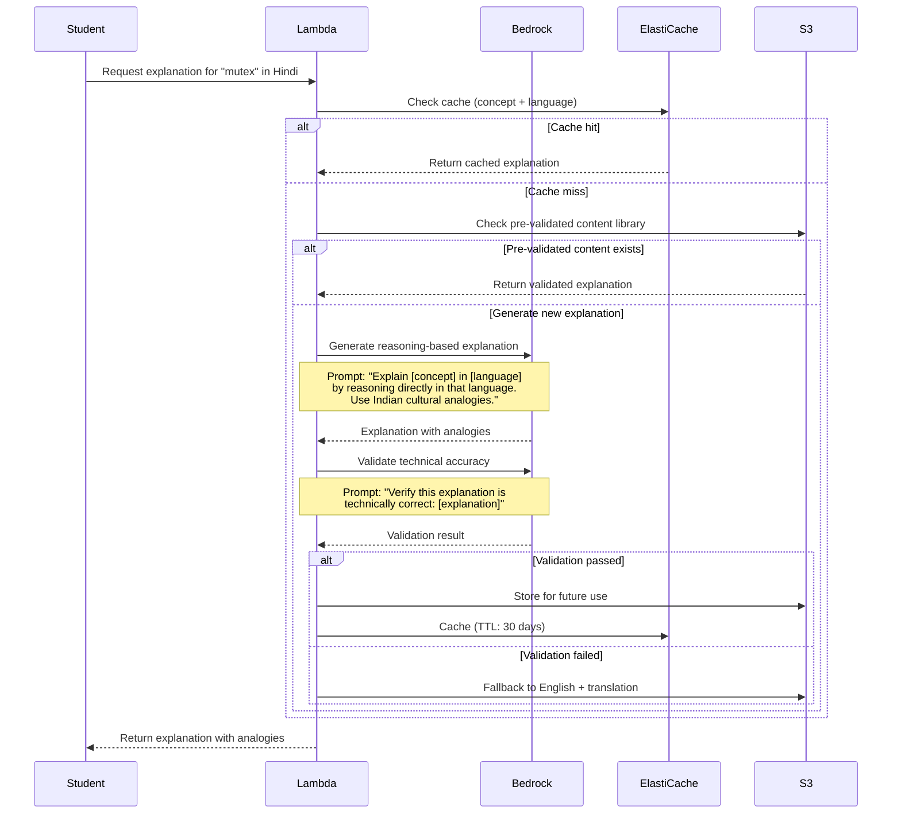
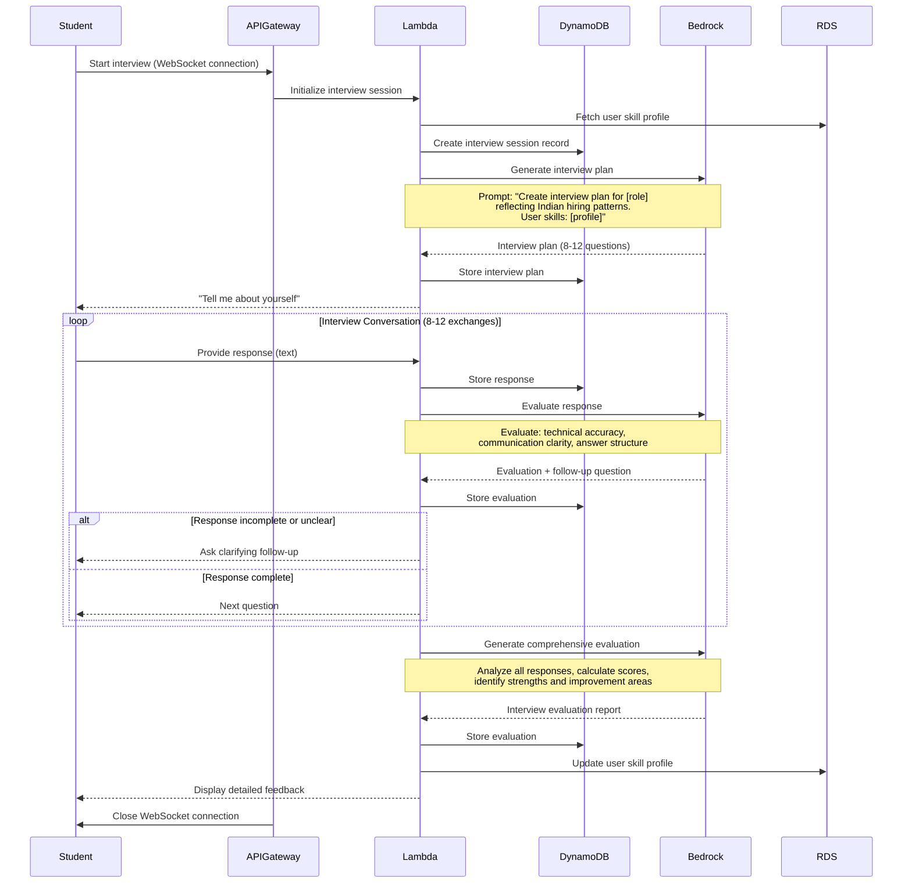
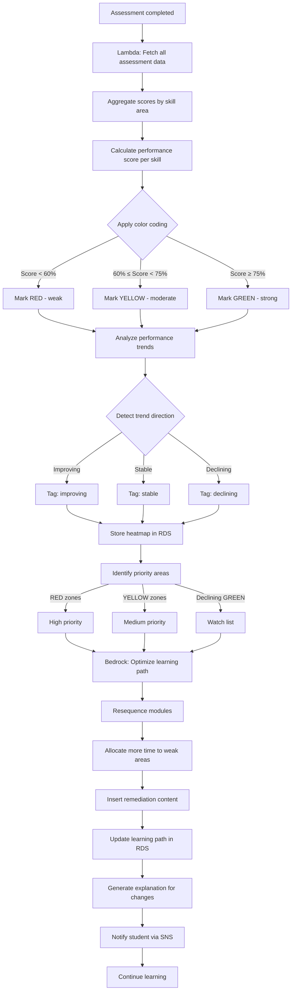
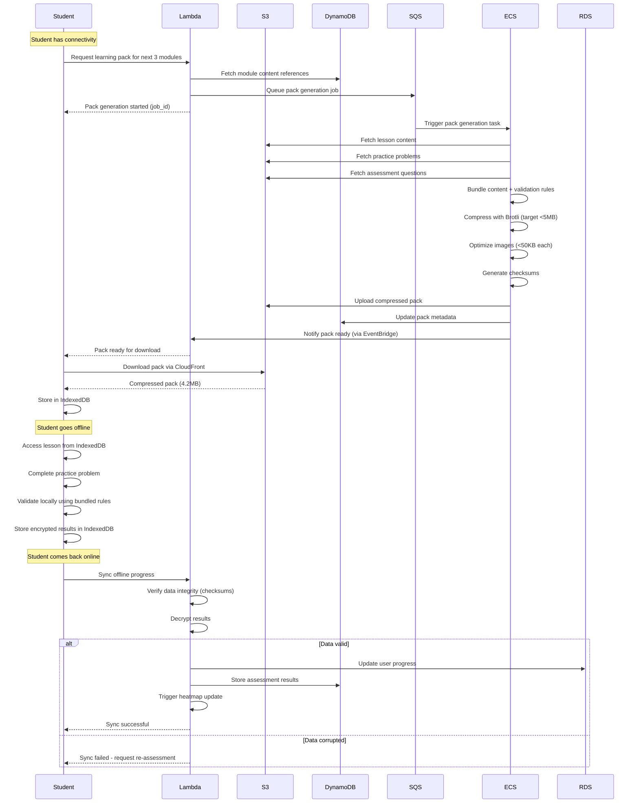

# Design Document: Campus-to-Hire Learning Coach

## Overview

The Campus-to-Hire Learning Coach is a mobile-first, AI-powered platform that transforms Tier-2/3 college students into job-ready candidates through structured, accountable learning. The system enforces mastery through readiness gates, provides multilingual reasoning-based explanations, and adapts learning paths based on performance heatmaps.

### Design Principles

1. **Mobile-First, Offline-Capable**: All features work on mobile devices with intermittent 2G/3G connectivity
2. **Text-Optimized**: Minimize rich media; prioritize text-based content for bandwidth efficiency
3. **Accountability-Driven**: Enforce mastery through readiness gates; prevent progression without verified understanding
4. **Culturally Grounded**: Multilingual support with reasoning-based explanations using local analogies
5. **Transparent AI**: Explain all recommendations with confidence levels and alternative paths
6. **Serverless-First**: Leverage AWS serverless services for cost optimization and auto-scaling

### Why This Architecture Exists

This design addresses specific constraints of the target user base:
- **Intermittent connectivity** → Offline-first architecture with sync
- **Low bandwidth** → Text-first, aggressive compression, CDN caching
- **Mobile-only access** → Progressive Web App with native app features
- **Cost sensitivity** → Serverless architecture minimizes idle costs
- **Scale requirements** → Auto-scaling to handle 10,000+ concurrent users
- **AI-driven personalization** → LLM integration for curriculum mapping and adaptive paths

## High-Level System Architecture



### Architecture Trade-offs

| Decision | Rationale | Trade-off |
|----------|-----------|-----------|
| **Serverless (Lambda)** | Cost optimization for variable load; auto-scaling | Cold start latency (mitigated with provisioned concurrency) |
| **DynamoDB for sessions** | Single-digit ms latency; auto-scaling | Higher cost than RDS for relational queries |
| **RDS PostgreSQL for user data** | ACID compliance; complex queries; data integrity | Requires capacity planning; less elastic than DynamoDB |
| **Amazon Bedrock** | Managed LLM access; no infrastructure management | Vendor lock-in; limited model customization |
| **CloudFront CDN** | Global edge caching; low latency | Cache invalidation complexity |
| **Offline-first PWA** | Works without connectivity; app-like experience | Complex sync logic; storage limits |


## AWS Services Integration

### Compute Services

**AWS Lambda**
- **Purpose**: Serverless compute for API endpoints and business logic
- **Configuration**:
  - Runtime: Node.js 20.x for API handlers, Python 3.11 for AI orchestration
  - Memory: 512MB-1024MB per function
  - Timeout: 30 seconds for API calls, 15 minutes for AI processing
  - Provisioned concurrency: 10 instances for critical paths (auth, assessment submission)
- **Functions**:
  - `auth-handler`: User authentication and token management
  - `user-profile`: CRUD operations for user profiles
  - `learning-path-generator`: Orchestrates curriculum mapping and path creation
  - `assessment-evaluator`: Evaluates assessment responses and calculates scores
  - `progress-tracker`: Updates user progress and heatmaps
  - `content-retriever`: Fetches lessons and learning materials
  - `sync-handler`: Processes offline sync requests

**Amazon ECS Fargate**
- **Purpose**: Long-running AI tasks that exceed Lambda limits
- **Use Cases**:
  - Batch curriculum mapping for new job roles
  - Interview simulation sessions (conversational AI)
  - Learning pack generation and compression
  - Heatmap analysis and path optimization
- **Configuration**:
  - Task CPU: 2 vCPU
  - Task Memory: 4GB
  - Auto-scaling: Target CPU utilization 70%
  - Spot instances for cost optimization on non-critical tasks

**Amazon SQS**
- **Purpose**: Decouple Lambda from long-running tasks
- **Queues**:
  - `ai-processing-queue`: AI generation tasks (FIFO for ordered processing)
  - `sync-queue`: Offline sync requests (Standard for high throughput)
  - `notification-queue`: User notifications (Standard)
  - `analytics-queue`: Event tracking (Standard)
- **Configuration**:
  - Visibility timeout: 15 minutes
  - Dead letter queue: After 3 retries
  - Message retention: 14 days

### AI/ML Services

**Amazon Bedrock**
- **Purpose**: Managed LLM access for content generation and reasoning
- **Models**:
  - **Claude 3 Sonnet**: Primary model for curriculum mapping, explanations, interview simulation
  - **Claude 3 Haiku**: Fast model for simple tasks (question generation, basic feedback)
  - **Llama 2 70B**: Fallback model for cost optimization
- **Configuration**:
  - Provisioned throughput: 1000 tokens/second for peak hours
  - On-demand for off-peak hours
  - Model customization: Fine-tune on Indian curriculum and job posting corpus
- **Use Cases**:
  - Curriculum-to-job semantic mapping
  - Multilingual explanation generation
  - Adaptive question generation
  - Interview conversation and evaluation
  - Learning path optimization

**Amazon OpenSearch Service**
- **Purpose**: Vector database for semantic search and embeddings
- **Configuration**:
  - Instance type: r6g.large.search (2 nodes for HA)
  - Storage: 100GB EBS
  - k-NN plugin enabled for vector similarity search
- **Use Cases**:
  - Store curriculum topic embeddings
  - Store job skill embeddings
  - Semantic search for content retrieval
  - Similar concept recommendations

**Amazon Translate**
- **Purpose**: Fallback translation when LLM reasoning fails
- **Configuration**:
  - Custom terminology: Technical terms dictionary
  - Batch translation for content migration
- **Use Cases**:
  - Translate UI strings
  - Fallback when LLM multilingual quality is low
  - Batch translate existing English content

**Amazon Comprehend**
- **Purpose**: Text analysis and quality validation
- **Use Cases**:
  - Sentiment analysis on user feedback
  - Key phrase extraction from interview responses
  - Language detection for user input
  - Content quality scoring

### Data Storage Services

**Amazon RDS PostgreSQL**
- **Purpose**: Primary relational database for structured data
- **Configuration**:
  - Instance: db.r6g.xlarge (4 vCPU, 32GB RAM)
  - Multi-AZ deployment for high availability
  - Read replicas: 2 replicas for read-heavy queries
  - Automated backups: Daily, 7-day retention
  - Encryption: AES-256 at rest
- **Schema Design**:
  ```sql
  -- Users table
  CREATE TABLE users (
    id UUID PRIMARY KEY,
    email VARCHAR(255) UNIQUE NOT NULL,
    password_hash VARCHAR(255) NOT NULL,
    name VARCHAR(255),
    college_name VARCHAR(255),
    college_tier INTEGER,
    preferred_language VARCHAR(10),
    target_role_id UUID,
    created_at TIMESTAMP DEFAULT NOW(),
    last_active TIMESTAMP
  );
  
  -- User progress table
  CREATE TABLE user_progress (
    user_id UUID PRIMARY KEY REFERENCES users(id),
    current_path_id UUID,
    job_readiness_score INTEGER,
    learning_streak INTEGER,
    total_time_spent INTEGER,
    updated_at TIMESTAMP DEFAULT NOW()
  );
  
  -- Skill profiles table
  CREATE TABLE skill_profiles (
    id UUID PRIMARY KEY,
    user_id UUID REFERENCES users(id),
    skill_area VARCHAR(100),
    competency_level VARCHAR(20),
    performance_score INTEGER,
    assessment_count INTEGER,
    last_assessed TIMESTAMP,
    trend VARCHAR(20)
  );
  
  -- Learning paths table
  CREATE TABLE learning_paths (
    id UUID PRIMARY KEY,
    user_id UUID REFERENCES users(id),
    target_role_id UUID,
    modules JSONB,
    current_module_index INTEGER,
    estimated_duration INTEGER,
    created_at TIMESTAMP,
    updated_at TIMESTAMP
  );
  
  -- Readiness gates table
  CREATE TABLE readiness_gates (
    id UUID PRIMARY KEY,
    module_id UUID,
    skill_area VARCHAR(100),
    mastery_threshold INTEGER DEFAULT 80,
    created_at TIMESTAMP
  );
  
  -- Gate attempts table
  CREATE TABLE gate_attempts (
    id UUID PRIMARY KEY,
    user_id UUID REFERENCES users(id),
    gate_id UUID REFERENCES readiness_gates(id),
    score INTEGER,
    passed BOOLEAN,
    attempt_number INTEGER,
    completed_at TIMESTAMP
  );
  ```

**Amazon DynamoDB**
- **Purpose**: High-performance NoSQL for session data and assessments
- **Tables**:
  
  **assessments** table:
  ```
  Partition Key: assessment_id (String)
  Sort Key: version (Number)
  Attributes: {
    type: String,
    skill_area: String,
    questions: List,
    adaptive_config: Map,
    created_at: Number (timestamp)
  }
  GSI: skill_area-created_at-index
  ```
  
  **assessment_attempts** table:
  ```
  Partition Key: user_id (String)
  Sort Key: attempt_id (String)
  Attributes: {
    assessment_id: String,
    responses: List,
    score: Number,
    passed: Boolean,
    started_at: Number,
    completed_at: Number,
    difficulty_progression: List
  }
  GSI: assessment_id-completed_at-index
  ```
  
  **interview_sessions** table:
  ```
  Partition Key: session_id (String)
  Attributes: {
    user_id: String,
    target_role: String,
    interview_type: String,
    conversation: List,
    evaluation: Map,
    status: String,
    started_at: Number,
    completed_at: Number
  }
  GSI: user_id-started_at-index
  ```
  
  **learning_packs** table:
  ```
  Partition Key: pack_id (String)
  Attributes: {
    user_id: String,
    skill_areas: List,
    language: String,
    content_keys: List (S3 keys),
    metadata: Map,
    created_at: Number,
    expires_at: Number
  }
  GSI: user_id-created_at-index
  ```

- **Configuration**:
  - Billing mode: On-demand (auto-scaling)
  - Point-in-time recovery: Enabled
  - Encryption: AWS managed keys
  - TTL: Enabled on expires_at for automatic cleanup

**Amazon S3**
- **Purpose**: Object storage for content, learning packs, and static assets
- **Buckets**:
  - `campus-coach-content`: Learning materials, lessons, code examples
  - `campus-coach-packs`: Compressed learning packs for offline use
  - `campus-coach-static`: Static assets (images, CSS, JS)
  - `campus-coach-backups`: Database backups and exports
- **Configuration**:
  - Versioning: Enabled on content bucket
  - Lifecycle policies: Move to Glacier after 90 days (backups)
  - Server-side encryption: SSE-S3
  - CORS: Configured for CloudFront access
  - Transfer acceleration: Enabled for faster uploads

**Amazon ElastiCache Redis**
- **Purpose**: In-memory caching and session management
- **Configuration**:
  - Node type: cache.r6g.large (2 nodes)
  - Cluster mode: Enabled for horizontal scaling
  - Automatic failover: Enabled
  - Backup: Daily snapshots, 7-day retention
- **Use Cases**:
  - Session storage (JWT tokens, user sessions)
  - API response caching (curriculum mappings, explanations)
  - Rate limiting counters
  - Real-time leaderboards
  - Temporary data for offline sync

### Networking & Security

**Amazon API Gateway**
- **Purpose**: Managed API gateway for REST and WebSocket APIs
- **Configuration**:
  - REST API: Regional endpoint
  - WebSocket API: For real-time interview simulation
  - Throttling: 1000 requests/second per account, 100/second per user
  - API keys: For mobile app authentication
  - Usage plans: Free tier (100 req/day), Premium tier (unlimited)
- **Endpoints**:
  - `POST /auth/login`: User authentication
  - `GET /users/{userId}/profile`: Get user profile
  - `POST /learning-paths/generate`: Generate learning path
  - `POST /assessments/{assessmentId}/submit`: Submit assessment
  - `GET /content/lessons/{lessonId}`: Retrieve lesson content
  - `POST /interviews/start`: Start interview session
  - `POST /sync/offline`: Sync offline progress
  - `GET /heatmaps/{userId}`: Get skill heatmap

**Amazon Cognito**
- **Purpose**: User authentication and authorization
- **Configuration**:
  - User pool: Email-based authentication
  - Password policy: Min 8 chars, uppercase, lowercase, number, special char
  - MFA: Optional SMS-based OTP
  - Token expiration: Access token 1 hour, refresh token 30 days
- **Features**:
  - Social login: Google, Facebook (future)
  - Custom attributes: college_tier, preferred_language, target_role
  - Lambda triggers: Pre-signup validation, post-confirmation welcome email

**Amazon CloudFront**
- **Purpose**: Global CDN for low-latency content delivery
- **Configuration**:
  - Origins: S3 (static assets), API Gateway (API calls)
  - Cache behaviors: 
    - Static assets: Cache for 1 year
    - API responses: Cache for 5 minutes (curriculum mappings, lessons)
    - User-specific data: No caching
  - Compression: Gzip and Brotli enabled
  - SSL/TLS: TLS 1.3, custom domain with ACM certificate
  - Geo-restriction: India-focused (optional)

**AWS WAF**
- **Purpose**: Web application firewall for DDoS protection
- **Rules**:
  - Rate limiting: 100 requests/5 minutes per IP
  - SQL injection protection
  - XSS protection
  - Geo-blocking: Block known malicious IPs
  - Bot detection: Challenge suspicious traffic

**AWS Secrets Manager**
- **Purpose**: Secure storage for secrets and credentials
- **Secrets**:
  - Database credentials (RDS, Redis)
  - API keys (Bedrock, third-party services)
  - JWT signing keys
  - Encryption keys
- **Configuration**:
  - Automatic rotation: Every 90 days
  - Encryption: AWS KMS

### Monitoring & Observability

**Amazon CloudWatch**
- **Metrics**:
  - Lambda: Invocations, duration, errors, throttles
  - API Gateway: Request count, latency, 4xx/5xx errors
  - RDS: CPU, memory, connections, read/write IOPS
  - DynamoDB: Read/write capacity, throttled requests
  - ECS: CPU, memory, task count
- **Logs**:
  - Lambda function logs
  - API Gateway access logs
  - Application logs from ECS
  - VPC flow logs
- **Alarms**:
  - Lambda error rate > 5%
  - API Gateway latency > 5 seconds (p95)
  - RDS CPU > 80%
  - DynamoDB throttled requests > 10/minute

**AWS X-Ray**
- **Purpose**: Distributed tracing for request flow analysis
- **Configuration**:
  - Enabled on Lambda, API Gateway, ECS
  - Sampling rate: 10% of requests
  - Trace retention: 30 days
- **Use Cases**:
  - Identify bottlenecks in request flow
  - Debug Lambda cold starts
  - Analyze AI service latency
  - Track end-to-end request duration

**Amazon SNS**
- **Purpose**: Notifications and alerts
- **Topics**:
  - `critical-alerts`: System failures, security incidents
  - `performance-alerts`: High latency, throttling
  - `user-notifications`: Welcome emails, progress updates
- **Subscriptions**:
  - Email: For critical alerts to ops team
  - SMS: For high-priority incidents
  - Lambda: For automated remediation


## Core AI Workflows

### 1. Curriculum-to-Job Mapping Workflow

**Objective**: Translate academic curriculum topics into job-relevant skills with semantic understanding.

**Flow**:


**Bedrock Prompt for Mapping**:
```
System: You are a curriculum mapping expert for Indian tech education.

Task: Map the academic topic to job skills and explain with concrete industry examples.

Academic Topic: {curriculum_topic}
Job Role: {target_role}
Job Skills: {required_skills}

Instructions:
1. Identify which job skills this topic directly supports
2. Explain the practical application in industry
3. Provide 2-3 concrete examples from Indian companies (TCS, Infosys, Flipkart, etc.)
4. Rate relevance: critical (must-know), important (should-know), supplementary (nice-to-know)

Output format:
{
  "mapped_skills": ["skill1", "skill2"],
  "relevance": "critical",
  "explanation": "...",
  "industry_examples": ["example1", "example2"],
  "confidence": 0.95
}
```

**Implementation Details**:
- **Embedding model**: Amazon Titan Embeddings (1536 dimensions)
- **Similarity threshold**: 0.7 for valid mappings
- **Caching strategy**: Cache by (curriculum_id, role_id) for 7 days
- **Fallback**: If Bedrock unavailable, use pre-computed mappings from knowledge base

### 2. Readiness Gate Assessment Workflow

**Objective**: Enforce mastery checkpoints with adaptive difficulty adjustment.

**Flow**:


**Adaptive Difficulty Algorithm**:
```python
class AdaptiveAssessment:
    def __init__(self):
        self.difficulty = 5  # Start at medium (1-10 scale)
        self.correct_streak = 0
        self.incorrect_streak = 0
        self.questions_asked = 0
        self.responses = []
    
    def adjust_difficulty(self, is_correct: bool):
        if is_correct:
            self.correct_streak += 1
            self.incorrect_streak = 0
            
            if self.correct_streak >= 2 and self.difficulty < 10:
                self.difficulty += 1
                self.correct_streak = 0
        else:
            self.incorrect_streak += 1
            self.correct_streak = 0
            
            if self.incorrect_streak >= 2 and self.difficulty > 1:
                self.difficulty -= 1
                self.incorrect_streak = 0
    
    def should_continue(self) -> bool:
        # Continue until 15-20 questions or clear competency determined
        if self.questions_asked < 15:
            return True
        if self.questions_asked >= 20:
            return False
        
        # Stop early if clear pattern emerges
        accuracy = sum(1 for r in self.responses if r.correct) / len(self.responses)
        if accuracy > 0.9 or accuracy < 0.4:
            return False
        
        return True
    
    def calculate_competency(self) -> str:
        accuracy = sum(1 for r in self.responses if r.correct) / len(self.responses)
        avg_difficulty = sum(r.difficulty for r in self.responses) / len(self.responses)
        
        if accuracy >= 0.8 and avg_difficulty >= 7:
            return "advanced"
        elif accuracy >= 0.7 and avg_difficulty >= 5:
            return "intermediate"
        else:
            return "beginner"
```

**Bedrock Prompt for Question Generation**:
```
System: You are an adaptive assessment generator for technical skills.

Task: Generate a multiple-choice question at the specified difficulty level.

Skill Area: {skill_area}
Difficulty: {difficulty}/10
Language: {language}
Previous Questions: {question_ids}  # Avoid duplicates

Requirements:
1. Test conceptual understanding, not memorization
2. Provide 4 options with exactly one correct answer
3. Include detailed explanation for the correct answer
4. Difficulty {difficulty} means:
   - 1-3: Basic recall and recognition
   - 4-6: Application and analysis
   - 7-9: Synthesis and evaluation
   - 10: Expert-level problem-solving

Output format:
{
  "question_text": "...",
  "options": ["A", "B", "C", "D"],
  "correct_answer": "B",
  "explanation": "...",
  "difficulty": {difficulty},
  "blooms_level": "apply"
}
```

### 3. Multilingual Reasoning-Based Explanation Workflow

**Objective**: Generate technical explanations in regional languages using culturally relevant analogies.

**Flow**:


**Bedrock Prompt for Multilingual Reasoning**:
```
System: You are a technical educator fluent in {language}. Explain concepts by reasoning directly in {language}, NOT by translating from English.

Task: Explain the technical concept using culturally relevant analogies from Indian daily life.

Concept: {technical_concept}
Target Language: {language}
User Context: College student, Tier-2/3 college, limited English fluency

Instructions:
1. Think and explain directly in {language} - do not translate from English
2. Use analogies from Indian daily life (railways, cricket, festivals, markets, etc.)
3. Preserve technical terms in English when no good local equivalent exists
4. Provide pronunciation guide for technical terms in local script
5. Include a simple code example if applicable
6. Maintain technical accuracy while adapting to language constraints

Cultural Context Library for {language}:
{cultural_analogies}

Output format:
{
  "explanation": "...",  # In target language
  "analogies": [
    {
      "description": "...",
      "cultural_context": "Indian railway reservation system",
      "mapping": {
        "technical_element": "mutex",
        "analogy_element": "ticket counter"
      }
    }
  ],
  "technical_terms": [
    {
      "term": "mutex",
      "preserved": true,
      "pronunciation": "म्यूटेक्स",
      "local_explanation": "..."
    }
  ],
  "code_example": "...",
  "confidence": 0.92
}
```

**Cultural Analogy Library** (stored in S3):
```json
{
  "hindi": {
    "mutex": "Railway ticket counter - one person at a time",
    "queue": "Bank line - first come first served",
    "stack": "Plate stack - last in first out",
    "cache": "Tiffin box - frequently used items nearby",
    "api": "Restaurant menu - order, kitchen processes, food delivered",
    "database": "Library catalog system",
    "encryption": "Coded letter - secret message"
  },
  "tamil": {
    "mutex": "Temple queue system - orderly access",
    "queue": "Bus stop line",
    "stack": "Idli plates stacked",
    "cache": "Nearby shop vs distant market",
    "api": "Hotel order system",
    "database": "Village records office",
    "encryption": "Secret code language"
  }
}
```

### 4. Interview Simulation Workflow

**Objective**: Conduct realistic mock interviews reflecting Indian hiring patterns.

**Flow**:


**Bedrock Prompt for Interview Simulation**:
```
System: You are an experienced technical interviewer for {company_type} in India, hiring for {role}.

Context:
- Company Type: {company_type}  # Service company, Product startup, MNC
- Role: {role}
- Candidate Skills: {skill_profile}
- Interview Type: {interview_type}  # Technical, Behavioral, Mixed

Task: Conduct a realistic interview reflecting Indian hiring patterns.

Indian Hiring Patterns:
1. Service companies (TCS, Infosys, Wipro): Focus on CS fundamentals, puzzle-solving, communication
2. Product startups (Flipkart, Swiggy, Razorpay): Focus on problem-solving, system design, coding
3. MNCs (Google, Microsoft, Amazon): Focus on algorithms, data structures, behavioral (STAR method)

Interview Structure:
1. Introduction (1 question): "Tell me about yourself"
2. Technical questions (5-7): Based on role and skill level
3. Behavioral questions (2-3): STAR method evaluation
4. Closing (1 question): "Do you have any questions for me?"

Evaluation Criteria:
- Technical Accuracy: Is the answer technically correct?
- Communication Clarity: Is the explanation clear and structured?
- Answer Structure: Does it follow STAR method (for behavioral)?
- Confidence Level: Does the candidate sound confident?
- Depth of Knowledge: Surface-level or deep understanding?

Instructions:
1. Ask one question at a time
2. Listen to the candidate's response
3. Ask follow-up questions if the response is incomplete
4. Evaluate each response on the criteria above
5. Adapt difficulty based on responses (easier if struggling, harder if excelling)
6. Be encouraging but professional

Current State:
- Questions asked: {questions_asked}
- Current question: {current_question}
- Candidate response: {candidate_response}

Generate:
1. Evaluation of the current response (scores 0-10 for each criterion)
2. Next question (or follow-up if response incomplete)
3. Brief internal notes on candidate performance so far

Output format:
{
  "evaluation": {
    "technical_accuracy": 8,
    "communication_clarity": 7,
    "answer_structure": 6,
    "confidence_level": 7,
    "depth": "intermediate",
    "feedback": "Good explanation but could provide more concrete examples"
  },
  "next_action": "follow_up" | "next_question" | "conclude",
  "next_question": "...",
  "internal_notes": "Candidate understands basics but struggles with advanced concepts"
}
```

**Interview Evaluation Prompt**:
```
System: You are an interview evaluation expert.

Task: Generate a comprehensive evaluation report for the completed interview.

Interview Data:
- Role: {role}
- Company Type: {company_type}
- Questions Asked: {questions}
- Candidate Responses: {responses}
- Individual Evaluations: {evaluations}

Generate:
1. Overall score (0-100)
2. Dimension scores:
   - Technical Accuracy (0-100)
   - Communication Clarity (0-100)
   - Answer Structure (0-100)
   - Confidence Level (0-100)
   - Behavioral Alignment (0-100)
3. Top 3 strengths
4. Top 3 improvement areas
5. Specific feedback for each question
6. Actionable next steps for improvement
7. Comparison to typical candidates at this level

Output format:
{
  "overall_score": 72,
  "dimension_scores": {...},
  "strengths": ["Strong CS fundamentals", "Clear communication", "Good examples"],
  "improvement_areas": ["Answer structure (use STAR)", "Provide more concrete examples", "Confidence in advanced topics"],
  "detailed_feedback": [
    {
      "question": "...",
      "response": "...",
      "evaluation": "...",
      "suggested_improvement": "..."
    }
  ],
  "next_steps": ["Practice STAR method", "Work on system design", "Mock interviews"],
  "percentile": 65
}
```


### 5. Weak-Area Heatmap and Adaptive Path Workflow

**Objective**: Identify performance patterns and dynamically adjust learning paths.

**Flow**:


**Heatmap Generation Algorithm**:
```python
class HeatmapGenerator:
    def generate_heatmap(self, user_id: str) -> SkillHeatmap:
        # Fetch all assessment attempts for user
        attempts = self.fetch_assessment_attempts(user_id)
        
        # Group by skill area
        skill_data = {}
        for attempt in attempts:
            skill = attempt.skill_area
            if skill not in skill_data:
                skill_data[skill] = []
            skill_data[skill].append({
                'score': attempt.score,
                'timestamp': attempt.completed_at
            })
        
        # Calculate performance score and trend for each skill
        heatmap_data = []
        for skill, data in skill_data.items():
            scores = [d['score'] for d in data]
            avg_score = sum(scores) / len(scores)
            
            # Determine status
            if avg_score < 60:
                status = 'weak'
                color = 'red'
            elif avg_score < 75:
                status = 'moderate'
                color = 'yellow'
            else:
                status = 'strong'
                color = 'green'
            
            # Detect trend (compare recent vs older scores)
            if len(scores) >= 3:
                recent_avg = sum(scores[-3:]) / 3
                older_avg = sum(scores[:-3]) / len(scores[:-3]) if len(scores) > 3 else avg_score
                
                if recent_avg > older_avg + 5:
                    trend = 'improving'
                elif recent_avg < older_avg - 5:
                    trend = 'declining'
                else:
                    trend = 'stable'
            else:
                trend = 'stable'
            
            heatmap_data.append({
                'skill_area': skill,
                'performance_score': avg_score,
                'status': status,
                'color': color,
                'trend': trend,
                'assessment_count': len(data),
                'last_assessed': max(d['timestamp'] for d in data)
            })
        
        # Sort by priority (red first, then yellow, then declining green)
        priority_order = {'weak': 0, 'moderate': 1, 'strong': 2}
        heatmap_data.sort(key=lambda x: (
            priority_order[x['status']],
            -1 if x['trend'] == 'declining' else 0,
            -x['performance_score']
        ))
        
        return SkillHeatmap(
            user_id=user_id,
            skill_areas=heatmap_data,
            overall_readiness=self.calculate_readiness(heatmap_data),
            priority_areas=[s['skill_area'] for s in heatmap_data if s['status'] == 'weak'],
            generated_at=datetime.now()
        )
    
    def calculate_readiness(self, heatmap_data: list) -> int:
        # Job readiness = weighted average of skill scores
        # Critical skills weighted 3x, important 2x, supplementary 1x
        total_weighted_score = 0
        total_weight = 0
        
        for skill in heatmap_data:
            importance = self.get_skill_importance(skill['skill_area'])
            weight = {'critical': 3, 'important': 2, 'supplementary': 1}[importance]
            
            total_weighted_score += skill['performance_score'] * weight
            total_weight += weight
        
        return int(total_weighted_score / total_weight) if total_weight > 0 else 0
```

**Bedrock Prompt for Path Optimization**:
```
System: You are a learning path optimizer.

Task: Adjust the learning path to prioritize weak areas while maintaining prerequisite dependencies.

Current State:
- User ID: {user_id}
- Current Path: {current_path}
- Skill Heatmap: {heatmap}
- Weak Areas (RED): {weak_areas}
- Moderate Areas (YELLOW): {moderate_areas}
- Time Remaining: {days_remaining} days
- Daily Study Time: {minutes_per_day} minutes

Constraints:
1. Respect prerequisite dependencies (can't learn advanced before basics)
2. Allocate 60% of time to RED zones, 30% to YELLOW zones, 10% to GREEN zones
3. Insert remediation content for failed readiness gates
4. Maintain motivation by including some easier content
5. Total duration should not exceed {days_remaining} days

Generate:
1. Resequenced module list with time allocation
2. Explanation for why this sequence is optimal
3. Specific remediation content for weak areas
4. Estimated completion date
5. Confidence level in this path

Output format:
{
  "optimized_path": [
    {
      "module_id": "...",
      "skill_area": "...",
      "estimated_time": 120,  # minutes
      "priority": "high",
      "reason": "RED zone - critical for job readiness"
    }
  ],
  "changes_made": {
    "reordered": ["module1", "module2"],
    "added_remediation": ["skill_area1"],
    "time_reallocation": "60% to weak areas"
  },
  "explanation": "Prioritized data structures (RED) before algorithms...",
  "estimated_completion": "2024-02-15",
  "confidence": 0.88
}
```

### 6. Learning Pack Generation and Offline Sync Workflow

**Objective**: Create compressed content bundles for offline use and sync progress when reconnected.

**Flow**:


**Learning Pack Structure**:
```json
{
  "pack_id": "pack_123",
  "user_id": "user_456",
  "skill_areas": ["data_structures", "algorithms"],
  "language": "hi",
  "version": "1.0",
  "created_at": "2024-01-15T10:00:00Z",
  "expires_at": "2024-01-22T10:00:00Z",
  "content": {
    "lessons": [
      {
        "lesson_id": "lesson_1",
        "title": "Binary Trees",
        "content": "...",  # Text content
        "code_examples": [...],
        "estimated_time": 30
      }
    ],
    "practice_problems": [
      {
        "problem_id": "prob_1",
        "title": "Tree Traversal",
        "description": "...",
        "test_cases": [...],
        "hints": [...]
      }
    ],
    "assessments": [
      {
        "assessment_id": "assess_1",
        "questions": [...],
        "validation_rules": "..."  # Client-side validation logic
      }
    ]
  },
  "offline_validation": {
    "checksums": {
      "lesson_1": "sha256_hash",
      "prob_1": "sha256_hash"
    },
    "validation_script": "base64_encoded_js"
  },
  "metadata": {
    "size_bytes": 4200000,
    "compression": "brotli",
    "compression_ratio": 0.72
  }
}
```

**Offline Validation Logic** (bundled with pack):
```javascript
// Client-side validation for offline assessments
class OfflineValidator {
  validateAnswer(question, userAnswer) {
    switch (question.type) {
      case 'multiple_choice':
        return userAnswer === question.correct_answer;
      
      case 'code_completion':
        // Run test cases locally
        return this.runTestCases(userAnswer, question.test_cases);
      
      case 'short_answer':
        // Keyword matching (simple validation)
        return this.matchKeywords(userAnswer, question.keywords);
    }
  }
  
  runTestCases(code, testCases) {
    // Execute code in sandboxed environment
    // Return true if all test cases pass
    try {
      const func = new Function('input', code);
      return testCases.every(tc => {
        const result = func(tc.input);
        return JSON.stringify(result) === JSON.stringify(tc.expected);
      });
    } catch (error) {
      return false;
    }
  }
  
  encryptResults(results) {
    // Encrypt results before storing locally
    // Prevents tampering
    const key = this.getDeviceKey();
    return CryptoJS.AES.encrypt(JSON.stringify(results), key).toString();
  }
  
  generateChecksum(data) {
    // Generate checksum for integrity verification
    return CryptoJS.SHA256(JSON.stringify(data)).toString();
  }
}
```

**Sync Conflict Resolution**:
```python
class SyncManager:
    def sync_offline_progress(self, user_id: str, offline_data: dict) -> SyncResult:
        # Verify data integrity
        if not self.verify_checksums(offline_data):
            return SyncResult(success=False, error="Data integrity check failed")
        
        # Decrypt results
        decrypted_data = self.decrypt(offline_data['encrypted_results'])
        
        # Fetch server state
        server_state = self.fetch_server_state(user_id)
        
        # Resolve conflicts
        conflicts = []
        for item in decrypted_data:
            if item['timestamp'] < server_state.get(item['id'], {}).get('timestamp', 0):
                # Server has newer data
                conflicts.append({
                    'item_id': item['id'],
                    'resolution': 'server_wins',
                    'reason': 'Server data is newer'
                })
            else:
                # Client data is newer or no conflict
                self.update_server(user_id, item)
        
        # Merge assessment results (keep all attempts)
        for assessment in decrypted_data.get('assessments', []):
            self.store_assessment_attempt(user_id, assessment)
        
        # Update progress
        self.update_user_progress(user_id, decrypted_data['progress'])
        
        # Trigger heatmap regeneration
        self.trigger_heatmap_update(user_id)
        
        return SyncResult(
            success=True,
            synced_items=len(decrypted_data),
            conflicts=conflicts
        )
```


## Components and Interfaces

### 1. User Service

**Purpose**: Manage user profiles, authentication, and preferences.

**API Endpoints**:
```typescript
// POST /auth/register
interface RegisterRequest {
  email: string;
  password: string;
  name: string;
  college_name: string;
  college_tier: 2 | 3;
  preferred_language: 'en' | 'hi' | 'ta' | 'te' | 'bn' | 'mr';
}

interface RegisterResponse {
  user_id: string;
  access_token: string;
  refresh_token: string;
}

// POST /auth/login
interface LoginRequest {
  email: string;
  password: string;
}

interface LoginResponse {
  user_id: string;
  access_token: string;
  refresh_token: string;
  expires_at: string;
}

// GET /users/{userId}/profile
interface UserProfile {
  id: string;
  email: string;
  name: string;
  college: {
    name: string;
    tier: 2 | 3;
    location: string;
  };
  preferences: {
    language: string;
    target_role: string;
    study_time_per_day: number;
  };
  created_at: string;
  last_active: string;
}

// PUT /users/{userId}/preferences
interface UpdatePreferencesRequest {
  language?: string;
  target_role?: string;
  study_time_per_day?: number;
  notification_settings?: NotificationSettings;
}
```

**Lambda Implementation**:
```python
# user_service/handler.py
import boto3
import bcrypt
import jwt
from datetime import datetime, timedelta

rds = boto3.client('rds-data')
cognito = boto3.client('cognito-idp')
secrets = boto3.client('secretsmanager')

def register_user(event, context):
    body = json.loads(event['body'])
    
    # Validate input
    if not validate_email(body['email']):
        return error_response(400, "Invalid email")
    
    # Hash password
    password_hash = bcrypt.hashpw(
        body['password'].encode('utf-8'),
        bcrypt.gensalt(rounds=12)
    )
    
    # Create user in RDS
    user_id = str(uuid.uuid4())
    execute_sql(
        "INSERT INTO users (id, email, password_hash, name, college_name, college_tier, preferred_language) "
        "VALUES (:id, :email, :password_hash, :name, :college_name, :college_tier, :language)",
        {
            'id': user_id,
            'email': body['email'],
            'password_hash': password_hash.decode('utf-8'),
            'name': body['name'],
            'college_name': body['college_name'],
            'college_tier': body['college_tier'],
            'language': body['preferred_language']
        }
    )
    
    # Generate JWT tokens
    access_token = generate_access_token(user_id)
    refresh_token = generate_refresh_token(user_id)
    
    # Store refresh token in Redis
    redis_client.setex(
        f"refresh_token:{user_id}",
        timedelta(days=30),
        refresh_token
    )
    
    return success_response({
        'user_id': user_id,
        'access_token': access_token,
        'refresh_token': refresh_token
    })

def generate_access_token(user_id: str) -> str:
    secret = get_jwt_secret()
    payload = {
        'user_id': user_id,
        'exp': datetime.utcnow() + timedelta(hours=1),
        'iat': datetime.utcnow()
    }
    return jwt.encode(payload, secret, algorithm='HS256')
```

### 2. Learning Path Service

**Purpose**: Generate and manage personalized learning paths.

**API Endpoints**:
```typescript
// POST /learning-paths/generate
interface GeneratePathRequest {
  user_id: string;
  target_role: string;
  time_constraint_days?: number;  // Default: 42 (6 weeks)
}

interface GeneratePathResponse {
  path_id: string;
  modules: LearningModule[];
  estimated_duration_days: number;
  confidence_level: 'high' | 'medium' | 'low';
  reasoning: string;
}

interface LearningModule {
  module_id: string;
  skill_area: string;
  title: string;
  content_refs: string[];  // S3 keys
  readiness_gate_id: string;
  estimated_time_minutes: number;
  prerequisites: string[];
  locked: boolean;
}

// GET /learning-paths/{pathId}
interface LearningPath {
  id: string;
  user_id: string;
  target_role: string;
  modules: LearningModule[];
  current_module_index: number;
  estimated_duration_days: number;
  created_at: string;
  updated_at: string;
}

// POST /learning-paths/{pathId}/adjust
interface AdjustPathRequest {
  reason: 'weak_area' | 'gate_failure' | 'user_request';
  weak_areas?: string[];
  failed_gate_id?: string;
}

interface AdjustPathResponse {
  updated_path: LearningPath;
  changes: {
    added: LearningModule[];
    removed: string[];
    reordered: boolean;
  };
  explanation: string;
}
```

**Lambda Implementation**:
```python
# learning_path_service/handler.py
import boto3
import json
from typing import List, Dict

bedrock = boto3.client('bedrock-runtime')
rds = boto3.client('rds-data')
opensearch = boto3.client('opensearch')

def generate_learning_path(event, context):
    body = json.loads(event['body'])
    user_id = body['user_id']
    target_role = body['target_role']
    
    # Fetch user curriculum and skill profile
    curriculum = fetch_user_curriculum(user_id)
    skill_profile = fetch_skill_profile(user_id)
    
    # Fetch job requirements
    job_requirements = fetch_job_requirements(target_role)
    
    # Generate curriculum mapping
    mapping = generate_curriculum_mapping(curriculum, job_requirements)
    
    # Invoke Bedrock to optimize learning path
    prompt = f"""
    Generate an optimal learning path for a student.
    
    Current Skills: {json.dumps(skill_profile)}
    Target Role: {target_role}
    Job Requirements: {json.dumps(job_requirements)}
    Curriculum Mapping: {json.dumps(mapping)}
    Time Constraint: {body.get('time_constraint_days', 42)} days
    
    Prioritize weak areas and respect prerequisite dependencies.
    """
    
    response = bedrock.invoke_model(
        modelId='anthropic.claude-3-sonnet-20240229-v1:0',
        body=json.dumps({
            'anthropic_version': 'bedrock-2023-05-31',
            'max_tokens': 4096,
            'messages': [
                {
                    'role': 'user',
                    'content': prompt
                }
            ]
        })
    )
    
    result = json.loads(response['body'].read())
    optimized_path = json.loads(result['content'][0]['text'])
    
    # Store learning path in RDS
    path_id = str(uuid.uuid4())
    execute_sql(
        "INSERT INTO learning_paths (id, user_id, target_role_id, modules, estimated_duration) "
        "VALUES (:id, :user_id, :target_role_id, :modules, :duration)",
        {
            'id': path_id,
            'user_id': user_id,
            'target_role_id': target_role,
            'modules': json.dumps(optimized_path['modules']),
            'duration': optimized_path['estimated_duration_days']
        }
    )
    
    return success_response({
        'path_id': path_id,
        'modules': optimized_path['modules'],
        'estimated_duration_days': optimized_path['estimated_duration_days'],
        'confidence_level': optimized_path['confidence'],
        'reasoning': optimized_path['explanation']
    })

def generate_curriculum_mapping(curriculum: Dict, job_requirements: Dict) -> Dict:
    # Generate embeddings for curriculum topics
    curriculum_embeddings = []
    for topic in curriculum['topics']:
        embedding = generate_embedding(topic['description'])
        curriculum_embeddings.append({
            'topic': topic,
            'embedding': embedding
        })
    
    # Generate embeddings for job skills
    skill_embeddings = []
    for skill in job_requirements['skills']:
        embedding = generate_embedding(skill['description'])
        skill_embeddings.append({
            'skill': skill,
            'embedding': embedding
        })
    
    # Store in OpenSearch
    for item in curriculum_embeddings:
        opensearch.index(
            index='curriculum_embeddings',
            body={
                'topic_id': item['topic']['id'],
                'embedding': item['embedding']
            }
        )
    
    # Query similar vectors
    mappings = []
    for skill_item in skill_embeddings:
        similar_topics = opensearch.search(
            index='curriculum_embeddings',
            body={
                'query': {
                    'knn': {
                        'embedding': {
                            'vector': skill_item['embedding'],
                            'k': 5
                        }
                    }
                }
            }
        )
        
        # Filter by similarity threshold
        for hit in similar_topics['hits']['hits']:
            if hit['_score'] > 0.7:
                mappings.append({
                    'curriculum_topic': hit['_source']['topic_id'],
                    'job_skill': skill_item['skill']['id'],
                    'similarity': hit['_score']
                })
    
    return {'mappings': mappings}

def generate_embedding(text: str) -> List[float]:
    response = bedrock.invoke_model(
        modelId='amazon.titan-embed-text-v1',
        body=json.dumps({'inputText': text})
    )
    result = json.loads(response['body'].read())
    return result['embedding']
```

### 3. Assessment Service

**Purpose**: Generate, evaluate, and manage adaptive assessments.

**API Endpoints**:
```typescript
// POST /assessments/create
interface CreateAssessmentRequest {
  type: 'readiness_gate' | 'practice' | 'diagnostic';
  skill_area: string;
  language: string;
  adaptive_config?: {
    starting_difficulty: number;
    min_questions: number;
    max_questions: number;
  };
}

interface CreateAssessmentResponse {
  assessment_id: string;
  initial_questions: Question[];
}

// POST /assessments/{assessmentId}/submit-response
interface SubmitResponseRequest {
  question_id: string;
  user_answer: string;
  time_spent_seconds: number;
}

interface SubmitResponseResponse {
  correct: boolean;
  feedback: string;
  next_question?: Question;
  assessment_complete: boolean;
  final_score?: number;
}

// GET /assessments/{assessmentId}/results
interface AssessmentResults {
  assessment_id: string;
  user_id: string;
  score: number;
  passed: boolean;
  competency_level: 'beginner' | 'intermediate' | 'advanced';
  weak_areas: string[];
  responses: ResponseDetail[];
  completed_at: string;
}

interface Question {
  question_id: string;
  question_text: string;
  question_type: 'multiple_choice' | 'code_completion' | 'short_answer';
  options?: string[];
  difficulty: number;
  language: string;
}

interface ResponseDetail {
  question_id: string;
  user_answer: string;
  correct: boolean;
  difficulty: number;
  time_spent: number;
  feedback: string;
}
```

**Lambda Implementation**:
```python
# assessment_service/handler.py
import boto3
import json
from typing import List, Dict

bedrock = boto3.client('bedrock-runtime')
dynamodb = boto3.resource('dynamodb')
assessments_table = dynamodb.Table('assessments')
attempts_table = dynamodb.Table('assessment_attempts')

class AdaptiveAssessment:
    def __init__(self, skill_area: str, language: str):
        self.skill_area = skill_area
        self.language = language
        self.difficulty = 5  # Start at medium
        self.correct_streak = 0
        self.incorrect_streak = 0
        self.questions_asked = 0
        self.responses = []
    
    def generate_next_question(self) -> Dict:
        prompt = f"""
        Generate a multiple-choice question for adaptive assessment.
        
        Skill Area: {self.skill_area}
        Difficulty: {self.difficulty}/10
        Language: {self.language}
        Previous Questions: {[r['question_id'] for r in self.responses]}
        
        Requirements:
        - Test conceptual understanding
        - Provide 4 options with one correct answer
        - Include detailed explanation
        - Avoid duplicates
        
        Output JSON format:
        {{
          "question_text": "...",
          "options": ["A", "B", "C", "D"],
          "correct_answer": "B",
          "explanation": "...",
          "difficulty": {self.difficulty}
        }}
        """
        
        response = bedrock.invoke_model(
            modelId='anthropic.claude-3-haiku-20240307-v1:0',
            body=json.dumps({
                'anthropic_version': 'bedrock-2023-05-31',
                'max_tokens': 2048,
                'messages': [{'role': 'user', 'content': prompt}]
            })
        )
        
        result = json.loads(response['body'].read())
        question_data = json.loads(result['content'][0]['text'])
        
        question_id = str(uuid.uuid4())
        question_data['question_id'] = question_id
        
        return question_data
    
    def evaluate_response(self, question: Dict, user_answer: str) -> Dict:
        is_correct = user_answer == question['correct_answer']
        
        # Adjust difficulty
        if is_correct:
            self.correct_streak += 1
            self.incorrect_streak = 0
            if self.correct_streak >= 2 and self.difficulty < 10:
                self.difficulty += 1
                self.correct_streak = 0
        else:
            self.incorrect_streak += 1
            self.correct_streak = 0
            if self.incorrect_streak >= 2 and self.difficulty > 1:
                self.difficulty -= 1
                self.incorrect_streak = 0
        
        self.questions_asked += 1
        self.responses.append({
            'question_id': question['question_id'],
            'user_answer': user_answer,
            'correct': is_correct,
            'difficulty': question['difficulty'],
            'feedback': question['explanation']
        })
        
        return {
            'correct': is_correct,
            'feedback': question['explanation'],
            'assessment_complete': self.should_complete(),
            'final_score': self.calculate_score() if self.should_complete() else None
        }
    
    def should_complete(self) -> bool:
        if self.questions_asked < 15:
            return False
        if self.questions_asked >= 20:
            return True
        
        # Stop early if clear pattern
        accuracy = sum(1 for r in self.responses if r['correct']) / len(self.responses)
        return accuracy > 0.9 or accuracy < 0.4
    
    def calculate_score(self) -> int:
        correct_count = sum(1 for r in self.responses if r['correct'])
        return int((correct_count / len(self.responses)) * 100)

def create_assessment(event, context):
    body = json.loads(event['body'])
    
    assessment = AdaptiveAssessment(
        skill_area=body['skill_area'],
        language=body['language']
    )
    
    # Generate initial questions
    initial_questions = [
        assessment.generate_next_question()
        for _ in range(3)
    ]
    
    # Store assessment in DynamoDB
    assessment_id = str(uuid.uuid4())
    assessments_table.put_item(
        Item={
            'assessment_id': assessment_id,
            'type': body['type'],
            'skill_area': body['skill_area'],
            'language': body['language'],
            'created_at': int(datetime.now().timestamp())
        }
    )
    
    # Store assessment state in Redis for session management
    redis_client.setex(
        f"assessment:{assessment_id}",
        timedelta(hours=2),
        json.dumps({
            'difficulty': assessment.difficulty,
            'questions_asked': 0,
            'responses': []
        })
    )
    
    return success_response({
        'assessment_id': assessment_id,
        'initial_questions': initial_questions
    })
```

### 4. Content Service

**Purpose**: Manage and deliver learning content with multilingual support.

**API Endpoints**:
```typescript
// GET /content/lessons/{lessonId}
interface GetLessonRequest {
  language: string;
}

interface Lesson {
  lesson_id: string;
  skill_area: string;
  title: string;
  content: string;
  code_examples: CodeExample[];
  diagrams: string[];  // CloudFront URLs
  estimated_read_time: number;
  language: string;
}

// POST /content/explain
interface ExplainConceptRequest {
  concept: string;
  language: string;
  user_context?: {
    skill_level: string;
    previous_topics: string[];
  };
}

interface ExplainConceptResponse {
  explanation: string;
  analogies: Analogy[];
  code_examples: CodeExample[];
  related_concepts: string[];
  confidence_level: 'high' | 'medium' | 'low';
}

// POST /content/learning-packs/generate
interface GeneratePackRequest {
  user_id: string;
  skill_areas: string[];
  language: string;
  module_count: number;
}

interface GeneratePackResponse {
  pack_id: string;
  download_url: string;  // CloudFront signed URL
  size_bytes: number;
  expires_at: string;
}
```

**Lambda Implementation**:
```python
# content_service/handler.py
import boto3
import json
from typing import Dict, List

s3 = boto3.client('s3')
bedrock = boto3.client('bedrock-runtime')
elasticache = boto3.client('elasticache')
cloudfront = boto3.client('cloudfront')

CONTENT_BUCKET = 'campus-coach-content'
PACKS_BUCKET = 'campus-coach-packs'

def get_lesson(event, context):
    lesson_id = event['pathParameters']['lessonId']
    language = event['queryStringParameters']['language']
    
    # Check cache
    cache_key = f"lesson:{lesson_id}:{language}"
    cached = redis_client.get(cache_key)
    if cached:
        return success_response(json.loads(cached))
    
    # Fetch from S3
    try:
        response = s3.get_object(
            Bucket=CONTENT_BUCKET,
            Key=f"lessons/{lesson_id}/{language}.json"
        )
        lesson_data = json.loads(response['Body'].read())
    except s3.exceptions.NoSuchKey:
        # Generate multilingual content if not exists
        lesson_data = generate_multilingual_lesson(lesson_id, language)
        
        # Store in S3
        s3.put_object(
            Bucket=CONTENT_BUCKET,
            Key=f"lessons/{lesson_id}/{language}.json",
            Body=json.dumps(lesson_data),
            ContentType='application/json'
        )
    
    # Cache for 30 days
    redis_client.setex(cache_key, timedelta(days=30), json.dumps(lesson_data))
    
    return success_response(lesson_data)

def explain_concept(event, context):
    body = json.loads(event['body'])
    concept = body['concept']
    language = body['language']
    
    # Check cache
    cache_key = f"explanation:{concept}:{language}"
    cached = redis_client.get(cache_key)
    if cached:
        return success_response(json.loads(cached))
    
    # Generate reasoning-based explanation
    prompt = f"""
    Explain the technical concept by reasoning directly in {language}.
    
    Concept: {concept}
    Target Language: {language}
    User Context: {json.dumps(body.get('user_context', {}))}
    
    Instructions:
    1. Think and explain directly in {language} - do not translate from English
    2. Use analogies from Indian daily life
    3. Preserve technical terms when no local equivalent exists
    4. Include a simple code example
    5. Maintain technical accuracy
    
    Cultural analogies for {language}:
    {get_cultural_analogies(language)}
    
    Output JSON format:
    {{
      "explanation": "...",
      "analogies": [
        {{
          "description": "...",
          "cultural_context": "...",
          "mapping": {{"technical": "...", "analogy": "..."}}
        }}
      ],
      "code_example": "...",
      "related_concepts": ["..."],
      "confidence": 0.92
    }}
    """
    
    response = bedrock.invoke_model(
        modelId='anthropic.claude-3-sonnet-20240229-v1:0',
        body=json.dumps({
            'anthropic_version': 'bedrock-2023-05-31',
            'max_tokens': 4096,
            'messages': [{'role': 'user', 'content': prompt}]
        })
    )
    
    result = json.loads(response['body'].read())
    explanation_data = json.loads(result['content'][0]['text'])
    
    # Validate technical accuracy
    if explanation_data['confidence'] < 0.7:
        # Fallback to pre-validated content
        explanation_data = get_fallback_explanation(concept, language)
    
    # Cache for 30 days
    redis_client.setex(cache_key, timedelta(days=30), json.dumps(explanation_data))
    
    return success_response(explanation_data)

def get_cultural_analogies(language: str) -> str:
    analogies = {
        'hi': {
            'mutex': 'Railway ticket counter',
            'queue': 'Bank line',
            'stack': 'Plate stack',
            'cache': 'Tiffin box',
            'api': 'Restaurant menu'
        },
        'ta': {
            'mutex': 'Temple queue',
            'queue': 'Bus stop line',
            'stack': 'Idli plates',
            'cache': 'Nearby shop',
            'api': 'Hotel order'
        }
    }
    return json.dumps(analogies.get(language, {}))
```


## Offline-First Architecture

### Progressive Web App (PWA) Design

**Service Worker Strategy**:
```javascript
// service-worker.js
const CACHE_VERSION = 'v1.0.0';
const STATIC_CACHE = `static-${CACHE_VERSION}`;
const DYNAMIC_CACHE = `dynamic-${CACHE_VERSION}`;
const OFFLINE_CACHE = `offline-${CACHE_VERSION}`;

// Assets to cache on install
const STATIC_ASSETS = [
  '/',
  '/index.html',
  '/styles/main.css',
  '/scripts/app.js',
  '/scripts/offline-validator.js',
  '/manifest.json',
  '/offline.html'
];

// Install event - cache static assets
self.addEventListener('install', (event) => {
  event.waitUntil(
    caches.open(STATIC_CACHE).then((cache) => {
      return cache.addAll(STATIC_ASSETS);
    })
  );
  self.skipWaiting();
});

// Activate event - clean old caches
self.addEventListener('activate', (event) => {
  event.waitUntil(
    caches.keys().then((cacheNames) => {
      return Promise.all(
        cacheNames
          .filter((name) => name !== STATIC_CACHE && name !== DYNAMIC_CACHE)
          .map((name) => caches.delete(name))
      );
    })
  );
  self.clients.claim();
});

// Fetch event - network first, fallback to cache
self.addEventListener('fetch', (event) => {
  const { request } = event;
  const url = new URL(request.url);
  
  // API requests - network first, cache fallback
  if (url.pathname.startsWith('/api/')) {
    event.respondWith(
      fetch(request)
        .then((response) => {
          // Clone and cache successful responses
          if (response.ok) {
            const responseClone = response.clone();
            caches.open(DYNAMIC_CACHE).then((cache) => {
              cache.put(request, responseClone);
            });
          }
          return response;
        })
        .catch(() => {
          // Fallback to cache
          return caches.match(request).then((cachedResponse) => {
            if (cachedResponse) {
              return cachedResponse;
            }
            // Return offline page for navigation requests
            if (request.mode === 'navigate') {
              return caches.match('/offline.html');
            }
            return new Response('Offline', { status: 503 });
          });
        })
    );
  }
  // Static assets - cache first
  else {
    event.respondWith(
      caches.match(request).then((cachedResponse) => {
        return cachedResponse || fetch(request);
      })
    );
  }
});

// Background sync for offline operations
self.addEventListener('sync', (event) => {
  if (event.tag === 'sync-progress') {
    event.waitUntil(syncOfflineProgress());
  }
});

async function syncOfflineProgress() {
  const db = await openIndexedDB();
  const pendingOperations = await db.getAll('pending_operations');
  
  for (const operation of pendingOperations) {
    try {
      const response = await fetch('/api/sync/offline', {
        method: 'POST',
        headers: { 'Content-Type': 'application/json' },
        body: JSON.stringify(operation.data)
      });
      
      if (response.ok) {
        await db.delete('pending_operations', operation.id);
      }
    } catch (error) {
      console.error('Sync failed:', error);
    }
  }
}
```

### IndexedDB Schema

**Database Structure**:
```javascript
// offline-db.js
const DB_NAME = 'CampusCoachDB';
const DB_VERSION = 1;

function openIndexedDB() {
  return new Promise((resolve, reject) => {
    const request = indexedDB.open(DB_NAME, DB_VERSION);
    
    request.onerror = () => reject(request.error);
    request.onsuccess = () => resolve(request.result);
    
    request.onupgradeneeded = (event) => {
      const db = event.target.result;
      
      // Learning packs store
      if (!db.objectStoreNames.contains('learning_packs')) {
        const packStore = db.createObjectStore('learning_packs', { keyPath: 'pack_id' });
        packStore.createIndex('user_id', 'user_id', { unique: false });
        packStore.createIndex('expires_at', 'expires_at', { unique: false });
      }
      
      // Lessons store
      if (!db.objectStoreNames.contains('lessons')) {
        const lessonStore = db.createObjectStore('lessons', { keyPath: 'lesson_id' });
        lessonStore.createIndex('skill_area', 'skill_area', { unique: false });
      }
      
      // Assessment attempts store
      if (!db.objectStoreNames.contains('assessment_attempts')) {
        const attemptStore = db.createObjectStore('assessment_attempts', { keyPath: 'attempt_id' });
        attemptStore.createIndex('assessment_id', 'assessment_id', { unique: false });
        attemptStore.createIndex('synced', 'synced', { unique: false });
      }
      
      // Pending operations store
      if (!db.objectStoreNames.contains('pending_operations')) {
        const opStore = db.createObjectStore('pending_operations', { keyPath: 'id', autoIncrement: true });
        opStore.createIndex('timestamp', 'timestamp', { unique: false });
      }
      
      // User progress store
      if (!db.objectStoreNames.contains('user_progress')) {
        db.createObjectStore('user_progress', { keyPath: 'user_id' });
      }
    };
  });
}

class OfflineStorage {
  constructor() {
    this.db = null;
  }
  
  async init() {
    this.db = await openIndexedDB();
  }
  
  // Store learning pack
  async storeLearningPack(pack) {
    const tx = this.db.transaction('learning_packs', 'readwrite');
    const store = tx.objectStore('learning_packs');
    await store.put(pack);
    return tx.complete;
  }
  
  // Get learning pack
  async getLearningPack(packId) {
    const tx = this.db.transaction('learning_packs', 'readonly');
    const store = tx.objectStore('learning_packs');
    return store.get(packId);
  }
  
  // Store assessment attempt (offline)
  async storeAssessmentAttempt(attempt) {
    const tx = this.db.transaction('assessment_attempts', 'readwrite');
    const store = tx.objectStore('assessment_attempts');
    
    // Encrypt results before storing
    const encrypted = await this.encryptData(attempt);
    encrypted.synced = false;
    encrypted.timestamp = Date.now();
    
    await store.put(encrypted);
    return tx.complete;
  }
  
  // Queue operation for sync
  async queueOperation(operation) {
    const tx = this.db.transaction('pending_operations', 'readwrite');
    const store = tx.objectStore('pending_operations');
    
    await store.add({
      type: operation.type,
      data: operation.data,
      timestamp: Date.now(),
      retryCount: 0
    });
    
    return tx.complete;
  }
  
  // Get pending operations
  async getPendingOperations() {
    const tx = this.db.transaction('pending_operations', 'readonly');
    const store = tx.objectStore('pending_operations');
    return store.getAll();
  }
  
  // Encrypt data for offline storage
  async encryptData(data) {
    const key = await this.getEncryptionKey();
    const jsonStr = JSON.stringify(data);
    const encoder = new TextEncoder();
    const dataBuffer = encoder.encode(jsonStr);
    
    const iv = crypto.getRandomValues(new Uint8Array(12));
    const encryptedBuffer = await crypto.subtle.encrypt(
      { name: 'AES-GCM', iv },
      key,
      dataBuffer
    );
    
    return {
      encrypted: Array.from(new Uint8Array(encryptedBuffer)),
      iv: Array.from(iv)
    };
  }
  
  // Decrypt data
  async decryptData(encryptedData) {
    const key = await this.getEncryptionKey();
    const encryptedBuffer = new Uint8Array(encryptedData.encrypted);
    const iv = new Uint8Array(encryptedData.iv);
    
    const decryptedBuffer = await crypto.subtle.decrypt(
      { name: 'AES-GCM', iv },
      key,
      encryptedBuffer
    );
    
    const decoder = new TextDecoder();
    const jsonStr = decoder.decode(decryptedBuffer);
    return JSON.parse(jsonStr);
  }
  
  // Get or generate encryption key
  async getEncryptionKey() {
    const keyData = localStorage.getItem('offline_encryption_key');
    if (keyData) {
      const keyBuffer = new Uint8Array(JSON.parse(keyData));
      return crypto.subtle.importKey(
        'raw',
        keyBuffer,
        { name: 'AES-GCM' },
        false,
        ['encrypt', 'decrypt']
      );
    }
    
    // Generate new key
    const key = await crypto.subtle.generateKey(
      { name: 'AES-GCM', length: 256 },
      true,
      ['encrypt', 'decrypt']
    );
    
    const exportedKey = await crypto.subtle.exportKey('raw', key);
    localStorage.setItem(
      'offline_encryption_key',
      JSON.stringify(Array.from(new Uint8Array(exportedKey)))
    );
    
    return key;
  }
}
```

### Offline Sync Manager

**Sync Strategy**:
```javascript
// sync-manager.js
class SyncManager {
  constructor() {
    this.storage = new OfflineStorage();
    this.syncInProgress = false;
  }
  
  async init() {
    await this.storage.init();
    
    // Register background sync
    if ('serviceWorker' in navigator && 'sync' in registration) {
      await navigator.serviceWorker.ready;
      await registration.sync.register('sync-progress');
    }
    
    // Listen for online event
    window.addEventListener('online', () => this.syncWhenOnline());
  }
  
  async syncWhenOnline() {
    if (this.syncInProgress) return;
    
    this.syncInProgress = true;
    
    try {
      // Get pending operations
      const operations = await this.storage.getPendingOperations();
      
      if (operations.length === 0) {
        console.log('No pending operations to sync');
        return;
      }
      
      // Prepare sync payload
      const syncPayload = {
        user_id: this.getUserId(),
        operations: []
      };
      
      for (const op of operations) {
        // Decrypt if encrypted
        let data = op.data;
        if (op.data.encrypted) {
          data = await this.storage.decryptData(op.data);
        }
        
        syncPayload.operations.push({
          type: op.type,
          data: data,
          timestamp: op.timestamp
        });
      }
      
      // Send to server
      const response = await fetch('/api/sync/offline', {
        method: 'POST',
        headers: {
          'Content-Type': 'application/json',
          'Authorization': `Bearer ${this.getAccessToken()}`
        },
        body: JSON.stringify(syncPayload)
      });
      
      if (!response.ok) {
        throw new Error(`Sync failed: ${response.statusText}`);
      }
      
      const result = await response.json();
      
      // Clear synced operations
      const db = await this.storage.db;
      const tx = db.transaction('pending_operations', 'readwrite');
      const store = tx.objectStore('pending_operations');
      
      for (const op of operations) {
        await store.delete(op.id);
      }
      
      await tx.complete;
      
      // Update local state with server response
      await this.updateLocalState(result);
      
      console.log(`Synced ${operations.length} operations successfully`);
      
      // Show success notification
      this.showNotification('Sync complete', 'Your progress has been synced');
      
    } catch (error) {
      console.error('Sync failed:', error);
      this.showNotification('Sync failed', 'Will retry when connection improves');
    } finally {
      this.syncInProgress = false;
    }
  }
  
  async updateLocalState(serverResponse) {
    // Update user progress
    if (serverResponse.updated_progress) {
      const tx = this.storage.db.transaction('user_progress', 'readwrite');
      const store = tx.objectStore('user_progress');
      await store.put(serverResponse.updated_progress);
    }
    
    // Update skill profile
    if (serverResponse.updated_skills) {
      localStorage.setItem('skill_profile', JSON.stringify(serverResponse.updated_skills));
    }
    
    // Update heatmap
    if (serverResponse.updated_heatmap) {
      localStorage.setItem('heatmap', JSON.stringify(serverResponse.updated_heatmap));
    }
  }
  
  getUserId() {
    return localStorage.getItem('user_id');
  }
  
  getAccessToken() {
    return localStorage.getItem('access_token');
  }
  
  showNotification(title, message) {
    if ('Notification' in window && Notification.permission === 'granted') {
      new Notification(title, { body: message });
    }
  }
}

// Initialize sync manager
const syncManager = new SyncManager();
syncManager.init();
```

### Data Compression Strategy

**Learning Pack Compression**:
```python
# pack_generator/compressor.py
import brotli
import json
from PIL import Image
from io import BytesIO

class PackCompressor:
    def __init__(self, target_size_mb=5):
        self.target_size_bytes = target_size_mb * 1024 * 1024
    
    def compress_pack(self, pack_data: dict) -> bytes:
        # Compress text content with Brotli
        text_content = self.extract_text_content(pack_data)
        compressed_text = brotli.compress(
            json.dumps(text_content).encode('utf-8'),
            quality=11  # Maximum compression
        )
        
        # Optimize images
        optimized_images = self.optimize_images(pack_data.get('images', []))
        
        # Combine compressed data
        final_pack = {
            'text': compressed_text,
            'images': optimized_images,
            'metadata': pack_data['metadata']
        }
        
        # Verify size
        final_size = len(json.dumps(final_pack).encode('utf-8'))
        if final_size > self.target_size_bytes:
            # Further compression needed
            final_pack = self.aggressive_compression(final_pack)
        
        return json.dumps(final_pack).encode('utf-8')
    
    def extract_text_content(self, pack_data: dict) -> dict:
        return {
            'lessons': pack_data.get('lessons', []),
            'problems': pack_data.get('problems', []),
            'assessments': pack_data.get('assessments', [])
        }
    
    def optimize_images(self, images: list) -> list:
        optimized = []
        for img_data in images:
            # Load image
            img = Image.open(BytesIO(img_data['bytes']))
            
            # Resize if too large
            max_width = 800
            if img.width > max_width:
                ratio = max_width / img.width
                new_height = int(img.height * ratio)
                img = img.resize((max_width, new_height), Image.LANCZOS)
            
            # Convert to WebP with quality 80
            output = BytesIO()
            img.save(output, format='WEBP', quality=80)
            webp_bytes = output.getvalue()
            
            # Ensure under 50KB
            if len(webp_bytes) > 50 * 1024:
                # Reduce quality further
                output = BytesIO()
                img.save(output, format='WEBP', quality=60)
                webp_bytes = output.getvalue()
            
            optimized.append({
                'id': img_data['id'],
                'bytes': webp_bytes,
                'format': 'webp'
            })
        
        return optimized
    
    def aggressive_compression(self, pack: dict) -> dict:
        # Remove non-essential content
        # Keep only critical lessons and problems
        text_data = json.loads(brotli.decompress(pack['text']))
        
        # Prioritize by importance
        text_data['lessons'] = text_data['lessons'][:5]  # Top 5 lessons
        text_data['problems'] = text_data['problems'][:10]  # Top 10 problems
        
        # Re-compress
        pack['text'] = brotli.compress(
            json.dumps(text_data).encode('utf-8'),
            quality=11
        )
        
        return pack
```

### Bandwidth Monitoring

**Client-Side Bandwidth Tracker**:
```javascript
// bandwidth-monitor.js
class BandwidthMonitor {
  constructor() {
    this.usage = {
      today: 0,
      thisWeek: 0,
      thisMonth: 0
    };
    this.budget = this.getUserBudget();
    this.loadUsageFromStorage();
  }
  
  trackRequest(url, size) {
    const now = new Date();
    const category = this.categorizeRequest(url);
    
    // Update usage
    this.usage.today += size;
    this.usage.thisWeek += size;
    this.usage.thisMonth += size;
    
    // Store in localStorage
    this.saveUsageToStorage();
    
    // Check budget
    if (this.usage.today > this.budget.daily) {
      this.warnUser('daily');
    }
    
    // Log for analytics
    this.logUsage(category, size);
  }
  
  categorizeRequest(url) {
    if (url.includes('/api/')) return 'api';
    if (url.includes('/content/')) return 'content';
    if (url.includes('/images/')) return 'media';
    return 'other';
  }
  
  getUserBudget() {
    const saved = localStorage.getItem('data_budget');
    return saved ? JSON.parse(saved) : {
      daily: 50 * 1024 * 1024,  // 50MB
      weekly: 300 * 1024 * 1024,  // 300MB
      monthly: 1024 * 1024 * 1024  // 1GB
    };
  }
  
  warnUser(period) {
    const message = `You've reached your ${period} data budget. Consider using Wi-Fi or adjusting your budget in settings.`;
    this.showWarning(message);
  }
  
  showWarning(message) {
    // Show in-app notification
    const notification = document.createElement('div');
    notification.className = 'data-warning';
    notification.textContent = message;
    document.body.appendChild(notification);
    
    setTimeout(() => notification.remove(), 5000);
  }
  
  getUsageStats() {
    return {
      usage: this.usage,
      budget: this.budget,
      percentage: {
        daily: (this.usage.today / this.budget.daily) * 100,
        weekly: (this.usage.thisWeek / this.budget.weekly) * 100,
        monthly: (this.usage.thisMonth / this.budget.monthly) * 100
      }
    };
  }
  
  saveUsageToStorage() {
    localStorage.setItem('bandwidth_usage', JSON.stringify({
      usage: this.usage,
      lastUpdated: new Date().toISOString()
    }));
  }
  
  loadUsageFromStorage() {
    const saved = localStorage.getItem('bandwidth_usage');
    if (saved) {
      const data = JSON.parse(saved);
      this.usage = data.usage;
      
      // Reset if new day/week/month
      this.resetIfNeeded(data.lastUpdated);
    }
  }
  
  resetIfNeeded(lastUpdated) {
    const last = new Date(lastUpdated);
    const now = new Date();
    
    // Reset daily if new day
    if (now.getDate() !== last.getDate()) {
      this.usage.today = 0;
    }
    
    // Reset weekly if new week
    if (this.getWeekNumber(now) !== this.getWeekNumber(last)) {
      this.usage.thisWeek = 0;
    }
    
    // Reset monthly if new month
    if (now.getMonth() !== last.getMonth()) {
      this.usage.thisMonth = 0;
    }
  }
  
  getWeekNumber(date) {
    const firstDayOfYear = new Date(date.getFullYear(), 0, 1);
    const pastDaysOfYear = (date - firstDayOfYear) / 86400000;
    return Math.ceil((pastDaysOfYear + firstDayOfYear.getDay() + 1) / 7);
  }
  
  logUsage(category, size) {
    // Send to analytics (when online)
    if (navigator.onLine) {
      fetch('/api/analytics/bandwidth', {
        method: 'POST',
        headers: { 'Content-Type': 'application/json' },
        body: JSON.stringify({
          category,
          size,
          timestamp: Date.now()
        })
      }).catch(() => {
        // Ignore errors - analytics is non-critical
      });
    }
  }
}

// Initialize bandwidth monitor
const bandwidthMonitor = new BandwidthMonitor();

// Intercept fetch requests to track bandwidth
const originalFetch = window.fetch;
window.fetch = function(...args) {
  return originalFetch.apply(this, args).then(response => {
    const contentLength = response.headers.get('content-length');
    if (contentLength) {
      bandwidthMonitor.trackRequest(args[0], parseInt(contentLength));
    }
    return response;
  });
};
```


## Security and Privacy Implementation

### Authentication Flow

**Cognito Integration**:
```python
# auth_service/cognito_handler.py
import boto3
import hmac
import hashlib
import base64

cognito_client = boto3.client('cognito-idp')
USER_POOL_ID = os.environ['COGNITO_USER_POOL_ID']
CLIENT_ID = os.environ['COGNITO_CLIENT_ID']
CLIENT_SECRET = os.environ['COGNITO_CLIENT_SECRET']

def register_user(email: str, password: str, attributes: dict) -> dict:
    # Calculate secret hash
    secret_hash = calculate_secret_hash(email)
    
    try:
        response = cognito_client.sign_up(
            ClientId=CLIENT_ID,
            SecretHash=secret_hash,
            Username=email,
            Password=password,
            UserAttributes=[
                {'Name': 'email', 'Value': email},
                {'Name': 'name', 'Value': attributes['name']},
                {'Name': 'custom:college_tier', 'Value': str(attributes['college_tier'])},
                {'Name': 'custom:preferred_language', 'Value': attributes['preferred_language']}
            ]
        )
        
        return {
            'user_sub': response['UserSub'],
            'user_confirmed': response['UserConfirmed']
        }
    except cognito_client.exceptions.UsernameExistsException:
        raise ValueError('User already exists')
    except cognito_client.exceptions.InvalidPasswordException:
        raise ValueError('Password does not meet requirements')

def authenticate_user(email: str, password: str) -> dict:
    secret_hash = calculate_secret_hash(email)
    
    try:
        response = cognito_client.initiate_auth(
            ClientId=CLIENT_ID,
            AuthFlow='USER_PASSWORD_AUTH',
            AuthParameters={
                'USERNAME': email,
                'PASSWORD': password,
                'SECRET_HASH': secret_hash
            }
        )
        
        return {
            'access_token': response['AuthenticationResult']['AccessToken'],
            'refresh_token': response['AuthenticationResult']['RefreshToken'],
            'id_token': response['AuthenticationResult']['IdToken'],
            'expires_in': response['AuthenticationResult']['ExpiresIn']
        }
    except cognito_client.exceptions.NotAuthorizedException:
        raise ValueError('Invalid credentials')
    except cognito_client.exceptions.UserNotFoundException:
        raise ValueError('User not found')

def refresh_access_token(refresh_token: str, email: str) -> dict:
    secret_hash = calculate_secret_hash(email)
    
    response = cognito_client.initiate_auth(
        ClientId=CLIENT_ID,
        AuthFlow='REFRESH_TOKEN_AUTH',
        AuthParameters={
            'REFRESH_TOKEN': refresh_token,
            'SECRET_HASH': secret_hash
        }
    )
    
    return {
        'access_token': response['AuthenticationResult']['AccessToken'],
        'id_token': response['AuthenticationResult']['IdToken'],
        'expires_in': response['AuthenticationResult']['ExpiresIn']
    }

def calculate_secret_hash(username: str) -> str:
    message = username + CLIENT_ID
    dig = hmac.new(
        CLIENT_SECRET.encode('utf-8'),
        msg=message.encode('utf-8'),
        digestmod=hashlib.sha256
    ).digest()
    return base64.b64encode(dig).decode()

def verify_token(access_token: str) -> dict:
    try:
        response = cognito_client.get_user(AccessToken=access_token)
        
        # Extract user attributes
        attributes = {}
        for attr in response['UserAttributes']:
            attributes[attr['Name']] = attr['Value']
        
        return {
            'username': response['Username'],
            'attributes': attributes
        }
    except cognito_client.exceptions.NotAuthorizedException:
        raise ValueError('Invalid or expired token')
```

### Data Encryption

**Encryption at Rest**:
```python
# encryption_service/kms_handler.py
import boto3
import base64
from cryptography.fernet import Fernet

kms_client = boto3.client('kms')
KMS_KEY_ID = os.environ['KMS_KEY_ID']

class EncryptionService:
    def __init__(self):
        self.kms_key_id = KMS_KEY_ID
        self.data_key_cache = {}
    
    def encrypt_field(self, plaintext: str, context: dict = None) -> str:
        """Encrypt a single field using KMS data key"""
        # Generate data key
        data_key = self.get_data_key(context)
        
        # Encrypt with Fernet
        f = Fernet(data_key)
        encrypted = f.encrypt(plaintext.encode('utf-8'))
        
        return base64.b64encode(encrypted).decode('utf-8')
    
    def decrypt_field(self, ciphertext: str, context: dict = None) -> str:
        """Decrypt a single field"""
        # Get data key
        data_key = self.get_data_key(context)
        
        # Decrypt with Fernet
        f = Fernet(data_key)
        encrypted_bytes = base64.b64decode(ciphertext.encode('utf-8'))
        decrypted = f.decrypt(encrypted_bytes)
        
        return decrypted.decode('utf-8')
    
    def get_data_key(self, context: dict = None) -> bytes:
        """Get or generate data key from KMS"""
        cache_key = str(context) if context else 'default'
        
        if cache_key in self.data_key_cache:
            return self.data_key_cache[cache_key]
        
        # Generate data key from KMS
        response = kms_client.generate_data_key(
            KeyId=self.kms_key_id,
            KeySpec='AES_256',
            EncryptionContext=context or {}
        )
        
        # Cache plaintext key (in memory only)
        plaintext_key = response['Plaintext']
        self.data_key_cache[cache_key] = base64.urlsafe_b64encode(plaintext_key)
        
        return self.data_key_cache[cache_key]
    
    def encrypt_large_data(self, data: bytes, context: dict = None) -> dict:
        """Encrypt large data (e.g., learning packs) using envelope encryption"""
        # Generate data key
        response = kms_client.generate_data_key(
            KeyId=self.kms_key_id,
            KeySpec='AES_256',
            EncryptionContext=context or {}
        )
        
        plaintext_key = response['Plaintext']
        encrypted_key = response['CiphertextBlob']
        
        # Encrypt data with data key
        f = Fernet(base64.urlsafe_b64encode(plaintext_key))
        encrypted_data = f.encrypt(data)
        
        return {
            'encrypted_data': encrypted_data,
            'encrypted_key': encrypted_key,
            'encryption_context': context
        }
    
    def decrypt_large_data(self, encrypted_package: dict) -> bytes:
        """Decrypt large data"""
        # Decrypt data key
        response = kms_client.decrypt(
            CiphertextBlob=encrypted_package['encrypted_key'],
            EncryptionContext=encrypted_package.get('encryption_context', {})
        )
        
        plaintext_key = response['Plaintext']
        
        # Decrypt data
        f = Fernet(base64.urlsafe_b64encode(plaintext_key))
        decrypted_data = f.decrypt(encrypted_package['encrypted_data'])
        
        return decrypted_data

# Initialize encryption service
encryption_service = EncryptionService()
```

**Encryption in Transit**:
```python
# API Gateway configuration (Terraform)
resource "aws_api_gateway_rest_api" "campus_coach_api" {
  name = "campus-coach-api"
  
  endpoint_configuration {
    types = ["REGIONAL"]
  }
  
  minimum_compression_size = 1024  # Compress responses > 1KB
}

resource "aws_api_gateway_domain_name" "api_domain" {
  domain_name              = "api.campuscoach.com"
  regional_certificate_arn = aws_acm_certificate.api_cert.arn
  
  security_policy = "TLS_1_3"  # Enforce TLS 1.3
  
  endpoint_configuration {
    types = ["REGIONAL"]
  }
}

resource "aws_acm_certificate" "api_cert" {
  domain_name       = "api.campuscoach.com"
  validation_method = "DNS"
  
  lifecycle {
    create_before_destroy = true
  }
}
```

### Privacy Controls

**Data Minimization**:
```python
# privacy_service/data_handler.py
class PrivacyService:
    def __init__(self):
        self.rds = boto3.client('rds-data')
        self.s3 = boto3.client('s3')
    
    def export_user_data(self, user_id: str) -> dict:
        """Export all user data (GDPR compliance)"""
        # Fetch from RDS
        user_profile = self.fetch_user_profile(user_id)
        user_progress = self.fetch_user_progress(user_id)
        skill_profile = self.fetch_skill_profile(user_id)
        
        # Fetch from DynamoDB
        assessments = self.fetch_assessment_attempts(user_id)
        interviews = self.fetch_interview_sessions(user_id)
        
        # Combine all data
        export_data = {
            'profile': user_profile,
            'progress': user_progress,
            'skills': skill_profile,
            'assessments': assessments,
            'interviews': interviews,
            'exported_at': datetime.now().isoformat()
        }
        
        # Store in S3 with expiration
        export_key = f"exports/{user_id}/{uuid.uuid4()}.json"
        self.s3.put_object(
            Bucket='campus-coach-backups',
            Key=export_key,
            Body=json.dumps(export_data),
            ContentType='application/json',
            ServerSideEncryption='AES256',
            Metadata={
                'user_id': user_id,
                'expires_at': (datetime.now() + timedelta(days=7)).isoformat()
            }
        )
        
        # Generate signed URL (valid for 7 days)
        download_url = self.s3.generate_presigned_url(
            'get_object',
            Params={'Bucket': 'campus-coach-backups', 'Key': export_key},
            ExpiresIn=7 * 24 * 3600
        )
        
        return {
            'download_url': download_url,
            'expires_at': (datetime.now() + timedelta(days=7)).isoformat()
        }
    
    def delete_user_data(self, user_id: str) -> dict:
        """Delete all user data (right to be forgotten)"""
        # Mark for deletion (30-day grace period)
        execute_sql(
            "UPDATE users SET deletion_requested_at = :timestamp, status = 'pending_deletion' "
            "WHERE id = :user_id",
            {'user_id': user_id, 'timestamp': datetime.now()}
        )
        
        # Schedule deletion job
        sqs = boto3.client('sqs')
        sqs.send_message(
            QueueUrl=os.environ['DELETION_QUEUE_URL'],
            MessageBody=json.dumps({'user_id': user_id}),
            DelaySeconds=30 * 24 * 3600  # 30 days
        )
        
        return {
            'status': 'pending_deletion',
            'grace_period_ends': (datetime.now() + timedelta(days=30)).isoformat()
        }
    
    def anonymize_analytics_data(self, user_id: str):
        """Anonymize user data for analytics while preserving insights"""
        # Replace user_id with anonymous hash
        anonymous_id = hashlib.sha256(user_id.encode()).hexdigest()
        
        # Update analytics records
        execute_sql(
            "UPDATE analytics_events SET user_id = :anonymous_id WHERE user_id = :user_id",
            {'anonymous_id': anonymous_id, 'user_id': user_id}
        )
        
        # Remove PII from stored data
        execute_sql(
            "UPDATE users SET email = NULL, name = 'Anonymous', phone = NULL "
            "WHERE id = :user_id",
            {'user_id': user_id}
        )
```

### Security Best Practices

**Input Validation**:
```python
# validation_service/validator.py
import re
from typing import Any, Dict

class InputValidator:
    EMAIL_REGEX = re.compile(r'^[a-zA-Z0-9._%+-]+@[a-zA-Z0-9.-]+\.[a-zA-Z]{2,}$')
    
    @staticmethod
    def validate_email(email: str) -> bool:
        return bool(InputValidator.EMAIL_REGEX.match(email))
    
    @staticmethod
    def sanitize_input(text: str) -> str:
        """Remove potentially dangerous characters"""
        # Remove HTML tags
        text = re.sub(r'<[^>]+>', '', text)
        # Remove SQL injection patterns
        text = re.sub(r'(--|;|\'|\"|\*|\/\*|\*\/)', '', text)
        # Remove XSS patterns
        text = re.sub(r'(javascript:|onerror=|onclick=)', '', text, flags=re.IGNORECASE)
        return text.strip()
    
    @staticmethod
    def validate_file_upload(file_data: bytes, allowed_types: list) -> Dict[str, Any]:
        """Validate file uploads"""
        import magic
        
        # Check file size (max 10MB)
        if len(file_data) > 10 * 1024 * 1024:
            return {'valid': False, 'error': 'File too large'}
        
        # Check file type
        mime = magic.from_buffer(file_data, mime=True)
        if mime not in allowed_types:
            return {'valid': False, 'error': 'Invalid file type'}
        
        return {'valid': True, 'mime_type': mime}
    
    @staticmethod
    def validate_json_schema(data: dict, schema: dict) -> Dict[str, Any]:
        """Validate JSON against schema"""
        from jsonschema import validate, ValidationError
        
        try:
            validate(instance=data, schema=schema)
            return {'valid': True}
        except ValidationError as e:
            return {'valid': False, 'error': str(e)}
```

**Rate Limiting**:
```python
# rate_limiter/handler.py
import boto3
from datetime import datetime, timedelta

redis_client = boto3.client('elasticache')

class RateLimiter:
    def __init__(self):
        self.redis = redis_client
    
    def check_rate_limit(self, user_id: str, endpoint: str, limit: int, window_seconds: int) -> dict:
        """Check if user has exceeded rate limit"""
        key = f"rate_limit:{user_id}:{endpoint}"
        
        # Get current count
        current = redis_client.get(key)
        
        if current is None:
            # First request in window
            redis_client.setex(key, window_seconds, 1)
            return {'allowed': True, 'remaining': limit - 1}
        
        current_count = int(current)
        
        if current_count >= limit:
            # Rate limit exceeded
            ttl = redis_client.ttl(key)
            return {
                'allowed': False,
                'remaining': 0,
                'retry_after': ttl
            }
        
        # Increment counter
        redis_client.incr(key)
        
        return {
            'allowed': True,
            'remaining': limit - current_count - 1
        }
    
    def apply_rate_limit(self, event: dict) -> dict:
        """Lambda authorizer for rate limiting"""
        user_id = event['requestContext']['authorizer']['claims']['sub']
        endpoint = event['resource']
        
        # Different limits for different endpoints
        limits = {
            '/api/assessments/submit': (10, 60),  # 10 per minute
            '/api/content/explain': (20, 60),  # 20 per minute
            '/api/learning-paths/generate': (5, 300),  # 5 per 5 minutes
            'default': (100, 60)  # 100 per minute
        }
        
        limit, window = limits.get(endpoint, limits['default'])
        
        result = self.check_rate_limit(user_id, endpoint, limit, window)
        
        if not result['allowed']:
            return {
                'statusCode': 429,
                'body': json.dumps({
                    'error': 'Rate limit exceeded',
                    'retry_after': result['retry_after']
                }),
                'headers': {
                    'Retry-After': str(result['retry_after']),
                    'X-RateLimit-Limit': str(limit),
                    'X-RateLimit-Remaining': '0'
                }
            }
        
        return {
            'statusCode': 200,
            'headers': {
                'X-RateLimit-Limit': str(limit),
                'X-RateLimit-Remaining': str(result['remaining'])
            }
        }
```

**Security Headers**:
```python
# security_headers/middleware.py
def add_security_headers(response: dict) -> dict:
    """Add security headers to all responses"""
    headers = response.get('headers', {})
    
    headers.update({
        # Prevent clickjacking
        'X-Frame-Options': 'DENY',
        
        # Prevent MIME sniffing
        'X-Content-Type-Options': 'nosniff',
        
        # Enable XSS protection
        'X-XSS-Protection': '1; mode=block',
        
        # Content Security Policy
        'Content-Security-Policy': (
            "default-src 'self'; "
            "script-src 'self' 'unsafe-inline' https://cdn.campuscoach.com; "
            "style-src 'self' 'unsafe-inline'; "
            "img-src 'self' data: https:; "
            "font-src 'self' data:; "
            "connect-src 'self' https://api.campuscoach.com; "
            "frame-ancestors 'none';"
        ),
        
        # Referrer policy
        'Referrer-Policy': 'strict-origin-when-cross-origin',
        
        # Permissions policy
        'Permissions-Policy': 'geolocation=(), microphone=(), camera=()',
        
        # HSTS (force HTTPS)
        'Strict-Transport-Security': 'max-age=31536000; includeSubDomains; preload'
    })
    
    response['headers'] = headers
    return response
```


## Error Handling and Reliability

### Error Handling Strategy

**Graceful Degradation**:
```python
# error_handler/graceful_degradation.py
class GracefulDegradation:
    def __init__(self):
        self.fallback_strategies = {
            'bedrock_unavailable': self.use_cached_content,
            'rds_unavailable': self.use_dynamodb_backup,
            'opensearch_unavailable': self.use_keyword_search,
            'network_timeout': self.return_cached_response
        }
    
    def handle_bedrock_failure(self, operation: str, params: dict) -> dict:
        """Handle Bedrock API failures"""
        try:
            # Try primary model
            return self.invoke_bedrock('claude-3-sonnet', params)
        except Exception as e:
            logger.warning(f"Claude Sonnet failed: {e}")
            
            try:
                # Fallback to Haiku (faster, cheaper)
                return self.invoke_bedrock('claude-3-haiku', params)
            except Exception as e:
                logger.warning(f"Claude Haiku failed: {e}")
                
                try:
                    # Fallback to Llama
                    return self.invoke_bedrock('llama-2-70b', params)
                except Exception as e:
                    logger.error(f"All LLM models failed: {e}")
                    
                    # Use pre-generated content
                    return self.use_cached_content(operation, params)
    
    def use_cached_content(self, operation: str, params: dict) -> dict:
        """Fallback to pre-generated content"""
        cache_key = f"{operation}:{json.dumps(params, sort_keys=True)}"
        
        # Check Redis cache
        cached = redis_client.get(cache_key)
        if cached:
            return json.loads(cached)
        
        # Check S3 knowledge base
        try:
            response = s3.get_object(
                Bucket='campus-coach-content',
                Key=f"fallback/{operation}/{hashlib.md5(cache_key.encode()).hexdigest()}.json"
            )
            return json.loads(response['Body'].read())
        except:
            # Return generic error message
            return {
                'error': 'Service temporarily unavailable',
                'fallback': True,
                'message': 'We are experiencing technical difficulties. Please try again later.'
            }
    
    def handle_database_failure(self, operation: str, params: dict) -> dict:
        """Handle database failures"""
        if operation == 'read':
            # Try read replica
            try:
                return self.query_read_replica(params)
            except:
                # Use cached data
                return self.get_from_cache(params)
        
        elif operation == 'write':
            # Queue for later processing
            sqs.send_message(
                QueueUrl=os.environ['RETRY_QUEUE_URL'],
                MessageBody=json.dumps({
                    'operation': operation,
                    'params': params,
                    'timestamp': datetime.now().isoformat()
                })
            )
            
            return {
                'status': 'queued',
                'message': 'Your request has been queued and will be processed shortly'
            }
```

**Retry Logic with Exponential Backoff**:
```python
# retry_handler/exponential_backoff.py
import time
import random
from typing import Callable, Any

class RetryHandler:
    def __init__(self, max_retries: int = 3, base_delay: float = 1.0):
        self.max_retries = max_retries
        self.base_delay = base_delay
    
    def retry_with_backoff(self, func: Callable, *args, **kwargs) -> Any:
        """Retry function with exponential backoff"""
        for attempt in range(self.max_retries):
            try:
                return func(*args, **kwargs)
            except Exception as e:
                if attempt == self.max_retries - 1:
                    # Last attempt failed
                    logger.error(f"All {self.max_retries} attempts failed: {e}")
                    raise
                
                # Calculate delay with jitter
                delay = self.base_delay * (2 ** attempt) + random.uniform(0, 1)
                logger.warning(f"Attempt {attempt + 1} failed: {e}. Retrying in {delay:.2f}s")
                time.sleep(delay)
    
    def retry_async(self, func: Callable, *args, **kwargs) -> Any:
        """Retry async function with exponential backoff"""
        import asyncio
        
        async def _retry():
            for attempt in range(self.max_retries):
                try:
                    return await func(*args, **kwargs)
                except Exception as e:
                    if attempt == self.max_retries - 1:
                        raise
                    
                    delay = self.base_delay * (2 ** attempt) + random.uniform(0, 1)
                    logger.warning(f"Attempt {attempt + 1} failed: {e}. Retrying in {delay:.2f}s")
                    await asyncio.sleep(delay)
        
        return asyncio.run(_retry())

# Usage example
retry_handler = RetryHandler(max_retries=3, base_delay=1.0)

def call_bedrock_with_retry(prompt: str) -> dict:
    return retry_handler.retry_with_backoff(
        bedrock.invoke_model,
        modelId='anthropic.claude-3-sonnet-20240229-v1:0',
        body=json.dumps({'prompt': prompt})
    )
```

**Circuit Breaker Pattern**:
```python
# circuit_breaker/handler.py
from enum import Enum
from datetime import datetime, timedelta

class CircuitState(Enum):
    CLOSED = "closed"  # Normal operation
    OPEN = "open"  # Failing, reject requests
    HALF_OPEN = "half_open"  # Testing if service recovered

class CircuitBreaker:
    def __init__(self, failure_threshold: int = 5, timeout_seconds: int = 60):
        self.failure_threshold = failure_threshold
        self.timeout = timedelta(seconds=timeout_seconds)
        self.failure_count = 0
        self.last_failure_time = None
        self.state = CircuitState.CLOSED
    
    def call(self, func: Callable, *args, **kwargs) -> Any:
        """Execute function with circuit breaker protection"""
        if self.state == CircuitState.OPEN:
            # Check if timeout has passed
            if datetime.now() - self.last_failure_time > self.timeout:
                self.state = CircuitState.HALF_OPEN
                logger.info("Circuit breaker entering HALF_OPEN state")
            else:
                raise Exception("Circuit breaker is OPEN - service unavailable")
        
        try:
            result = func(*args, **kwargs)
            
            # Success - reset if in HALF_OPEN
            if self.state == CircuitState.HALF_OPEN:
                self.state = CircuitState.CLOSED
                self.failure_count = 0
                logger.info("Circuit breaker CLOSED - service recovered")
            
            return result
        
        except Exception as e:
            self.failure_count += 1
            self.last_failure_time = datetime.now()
            
            if self.failure_count >= self.failure_threshold:
                self.state = CircuitState.OPEN
                logger.error(f"Circuit breaker OPEN after {self.failure_count} failures")
            
            raise

# Initialize circuit breakers for external services
bedrock_circuit_breaker = CircuitBreaker(failure_threshold=5, timeout_seconds=60)
rds_circuit_breaker = CircuitBreaker(failure_threshold=3, timeout_seconds=30)
```

### Monitoring and Alerting

**CloudWatch Metrics**:
```python
# monitoring/cloudwatch_metrics.py
import boto3
from datetime import datetime

cloudwatch = boto3.client('cloudwatch')

class MetricsPublisher:
    def __init__(self, namespace: str = 'CampusCoach'):
        self.namespace = namespace
    
    def publish_metric(self, metric_name: str, value: float, unit: str = 'Count', dimensions: dict = None):
        """Publish custom metric to CloudWatch"""
        metric_data = {
            'MetricName': metric_name,
            'Value': value,
            'Unit': unit,
            'Timestamp': datetime.now()
        }
        
        if dimensions:
            metric_data['Dimensions'] = [
                {'Name': k, 'Value': v} for k, v in dimensions.items()
            ]
        
        cloudwatch.put_metric_data(
            Namespace=self.namespace,
            MetricData=[metric_data]
        )
    
    def publish_assessment_metrics(self, assessment_data: dict):
        """Publish assessment-related metrics"""
        self.publish_metric(
            'AssessmentCompleted',
            1,
            dimensions={
                'SkillArea': assessment_data['skill_area'],
                'Passed': str(assessment_data['passed'])
            }
        )
        
        self.publish_metric(
            'AssessmentScore',
            assessment_data['score'],
            unit='None',
            dimensions={'SkillArea': assessment_data['skill_area']}
        )
        
        self.publish_metric(
            'AssessmentDuration',
            assessment_data['duration_seconds'],
            unit='Seconds',
            dimensions={'SkillArea': assessment_data['skill_area']}
        )
    
    def publish_ai_metrics(self, operation: str, latency_ms: float, success: bool):
        """Publish AI service metrics"""
        self.publish_metric(
            'AIOperationLatency',
            latency_ms,
            unit='Milliseconds',
            dimensions={
                'Operation': operation,
                'Success': str(success)
            }
        )
        
        self.publish_metric(
            'AIOperationCount',
            1,
            dimensions={
                'Operation': operation,
                'Success': str(success)
            }
        )
    
    def publish_error_metric(self, error_type: str, service: str):
        """Publish error metrics"""
        self.publish_metric(
            'ErrorCount',
            1,
            dimensions={
                'ErrorType': error_type,
                'Service': service
            }
        )

metrics_publisher = MetricsPublisher()
```

**CloudWatch Alarms**:
```python
# monitoring/alarms.py (Terraform configuration)
resource "aws_cloudwatch_metric_alarm" "lambda_errors" {
  alarm_name          = "campus-coach-lambda-errors"
  comparison_operator = "GreaterThanThreshold"
  evaluation_periods  = "2"
  metric_name         = "Errors"
  namespace           = "AWS/Lambda"
  period              = "300"
  statistic           = "Sum"
  threshold           = "10"
  alarm_description   = "Lambda error rate exceeded threshold"
  alarm_actions       = [aws_sns_topic.alerts.arn]
  
  dimensions = {
    FunctionName = "campus-coach-*"
  }
}

resource "aws_cloudwatch_metric_alarm" "api_latency" {
  alarm_name          = "campus-coach-api-latency"
  comparison_operator = "GreaterThanThreshold"
  evaluation_periods  = "2"
  metric_name         = "Latency"
  namespace           = "AWS/ApiGateway"
  period              = "300"
  statistic           = "Average"
  threshold           = "5000"  # 5 seconds
  alarm_description   = "API latency exceeded 5 seconds"
  alarm_actions       = [aws_sns_topic.alerts.arn]
}

resource "aws_cloudwatch_metric_alarm" "rds_cpu" {
  alarm_name          = "campus-coach-rds-cpu"
  comparison_operator = "GreaterThanThreshold"
  evaluation_periods  = "2"
  metric_name         = "CPUUtilization"
  namespace           = "AWS/RDS"
  period              = "300"
  statistic           = "Average"
  threshold           = "80"
  alarm_description   = "RDS CPU utilization exceeded 80%"
  alarm_actions       = [aws_sns_topic.alerts.arn]
}

resource "aws_cloudwatch_metric_alarm" "bedrock_throttling" {
  alarm_name          = "campus-coach-bedrock-throttling"
  comparison_operator = "GreaterThanThreshold"
  evaluation_periods  = "1"
  metric_name         = "ModelInvocationThrottles"
  namespace           = "AWS/Bedrock"
  period              = "60"
  statistic           = "Sum"
  threshold           = "5"
  alarm_description   = "Bedrock throttling detected"
  alarm_actions       = [aws_sns_topic.alerts.arn]
}
```

**Distributed Tracing with X-Ray**:
```python
# tracing/xray_handler.py
from aws_xray_sdk.core import xray_recorder
from aws_xray_sdk.core import patch_all

# Patch all supported libraries
patch_all()

@xray_recorder.capture('generate_learning_path')
def generate_learning_path(user_id: str, target_role: str) -> dict:
    # Add metadata to trace
    xray_recorder.put_metadata('user_id', user_id)
    xray_recorder.put_metadata('target_role', target_role)
    
    # Subsegment for curriculum mapping
    with xray_recorder.capture('curriculum_mapping'):
        curriculum = fetch_user_curriculum(user_id)
        mapping = generate_curriculum_mapping(curriculum, target_role)
        xray_recorder.put_annotation('mapping_count', len(mapping['mappings']))
    
    # Subsegment for Bedrock invocation
    with xray_recorder.capture('bedrock_optimization'):
        optimized_path = invoke_bedrock_for_path(mapping)
        xray_recorder.put_annotation('path_duration_days', optimized_path['estimated_duration_days'])
    
    # Subsegment for database write
    with xray_recorder.capture('store_learning_path'):
        path_id = store_learning_path(user_id, optimized_path)
    
    return {'path_id': path_id, 'path': optimized_path}
```

### Logging Strategy

**Structured Logging**:
```python
# logging/structured_logger.py
import json
import logging
from datetime import datetime

class StructuredLogger:
    def __init__(self, service_name: str):
        self.service_name = service_name
        self.logger = logging.getLogger(service_name)
        self.logger.setLevel(logging.INFO)
    
    def log(self, level: str, message: str, **kwargs):
        """Log structured JSON"""
        log_entry = {
            'timestamp': datetime.now().isoformat(),
            'service': self.service_name,
            'level': level,
            'message': message,
            **kwargs
        }
        
        if level == 'ERROR':
            self.logger.error(json.dumps(log_entry))
        elif level == 'WARNING':
            self.logger.warning(json.dumps(log_entry))
        else:
            self.logger.info(json.dumps(log_entry))
    
    def log_request(self, request_id: str, user_id: str, endpoint: str, method: str):
        """Log API request"""
        self.log('INFO', 'API Request', 
                 request_id=request_id,
                 user_id=user_id,
                 endpoint=endpoint,
                 method=method)
    
    def log_response(self, request_id: str, status_code: int, duration_ms: float):
        """Log API response"""
        self.log('INFO', 'API Response',
                 request_id=request_id,
                 status_code=status_code,
                 duration_ms=duration_ms)
    
    def log_error(self, error: Exception, context: dict = None):
        """Log error with context"""
        self.log('ERROR', str(error),
                 error_type=type(error).__name__,
                 stack_trace=traceback.format_exc(),
                 context=context or {})
    
    def log_ai_operation(self, operation: str, model: str, latency_ms: float, success: bool):
        """Log AI operation"""
        self.log('INFO', 'AI Operation',
                 operation=operation,
                 model=model,
                 latency_ms=latency_ms,
                 success=success)

logger = StructuredLogger('campus-coach')
```

**Log Aggregation and Analysis**:
```python
# CloudWatch Logs Insights queries
# Query 1: Find slow API endpoints
fields @timestamp, endpoint, duration_ms
| filter duration_ms > 5000
| sort duration_ms desc
| limit 20

# Query 2: Error rate by service
fields @timestamp, service, error_type
| filter level = "ERROR"
| stats count() by service, error_type

# Query 3: AI operation latency
fields @timestamp, operation, model, latency_ms
| filter operation = "curriculum_mapping"
| stats avg(latency_ms), max(latency_ms), min(latency_ms) by model

# Query 4: User journey tracking
fields @timestamp, user_id, endpoint
| filter user_id = "user_123"
| sort @timestamp asc
```

## Testing Strategy

### Unit Testing

**Lambda Function Tests**:
```python
# tests/test_learning_path_service.py
import pytest
from unittest.mock import Mock, patch
from learning_path_service.handler import generate_learning_path

@pytest.fixture
def mock_bedrock():
    with patch('boto3.client') as mock:
        yield mock.return_value

@pytest.fixture
def mock_rds():
    with patch('learning_path_service.handler.execute_sql') as mock:
        yield mock

def test_generate_learning_path_success(mock_bedrock, mock_rds):
    # Arrange
    mock_bedrock.invoke_model.return_value = {
        'body': Mock(read=lambda: json.dumps({
            'content': [{
                'text': json.dumps({
                    'modules': [{'module_id': 'mod1', 'skill_area': 'data_structures'}],
                    'estimated_duration_days': 42,
                    'confidence': 'high'
                })
            }]
        }))
    }
    
    event = {
        'body': json.dumps({
            'user_id': 'user_123',
            'target_role': 'backend_developer'
        })
    }
    
    # Act
    response = generate_learning_path(event, {})
    
    # Assert
    assert response['statusCode'] == 200
    body = json.loads(response['body'])
    assert 'path_id' in body
    assert len(body['modules']) > 0
    assert body['confidence_level'] == 'high'

def test_generate_learning_path_bedrock_failure(mock_bedrock, mock_rds):
    # Arrange
    mock_bedrock.invoke_model.side_effect = Exception('Bedrock unavailable')
    
    event = {
        'body': json.dumps({
            'user_id': 'user_123',
            'target_role': 'backend_developer'
        })
    }
    
    # Act
    response = generate_learning_path(event, {})
    
    # Assert
    assert response['statusCode'] == 503
    body = json.loads(response['body'])
    assert 'fallback' in body
```

### Integration Testing

**API Integration Tests**:
```python
# tests/integration/test_api_flow.py
import requests
import pytest

BASE_URL = 'https://api-dev.campuscoach.com'

@pytest.fixture
def authenticated_user():
    # Register and login
    response = requests.post(f'{BASE_URL}/auth/register', json={
        'email': 'test@example.com',
        'password': 'Test@1234',
        'name': 'Test User',
        'college_name': 'Test College',
        'college_tier': 2,
        'preferred_language': 'en'
    })
    
    assert response.status_code == 200
    return response.json()

def test_complete_learning_flow(authenticated_user):
    access_token = authenticated_user['access_token']
    headers = {'Authorization': f'Bearer {access_token}'}
    
    # 1. Generate learning path
    response = requests.post(
        f'{BASE_URL}/learning-paths/generate',
        headers=headers,
        json={'target_role': 'backend_developer'}
    )
    assert response.status_code == 200
    path = response.json()
    assert 'path_id' in path
    
    # 2. Get first module
    first_module = path['modules'][0]
    
    # 3. Get lesson content
    response = requests.get(
        f'{BASE_URL}/content/lessons/{first_module["content_refs"][0]}',
        headers=headers,
        params={'language': 'en'}
    )
    assert response.status_code == 200
    lesson = response.json()
    assert 'content' in lesson
    
    # 4. Start readiness gate assessment
    response = requests.post(
        f'{BASE_URL}/assessments/create',
        headers=headers,
        json={
            'type': 'readiness_gate',
            'skill_area': first_module['skill_area'],
            'language': 'en'
        }
    )
    assert response.status_code == 200
    assessment = response.json()
    
    # 5. Submit responses
    for question in assessment['initial_questions']:
        response = requests.post(
            f'{BASE_URL}/assessments/{assessment["assessment_id"]}/submit-response',
            headers=headers,
            json={
                'question_id': question['question_id'],
                'user_answer': question['options'][0],  # Just pick first option
                'time_spent_seconds': 30
            }
        )
        assert response.status_code == 200
```

### Load Testing

**Locust Load Test**:
```python
# tests/load/locustfile.py
from locust import HttpUser, task, between

class CampusCoachUser(HttpUser):
    wait_time = between(1, 3)
    
    def on_start(self):
        # Login
        response = self.client.post('/auth/login', json={
            'email': 'loadtest@example.com',
            'password': 'Test@1234'
        })
        self.access_token = response.json()['access_token']
        self.headers = {'Authorization': f'Bearer {self.access_token}'}
    
    @task(3)
    def get_lesson(self):
        self.client.get(
            '/content/lessons/lesson_123',
            headers=self.headers,
            params={'language': 'en'}
        )
    
    @task(2)
    def submit_assessment_response(self):
        self.client.post(
            '/assessments/assess_123/submit-response',
            headers=self.headers,
            json={
                'question_id': 'q_456',
                'user_answer': 'A',
                'time_spent_seconds': 30
            }
        )
    
    @task(1)
    def generate_learning_path(self):
        self.client.post(
            '/learning-paths/generate',
            headers=self.headers,
            json={'target_role': 'backend_developer'}
        )

# Run: locust -f locustfile.py --host=https://api-dev.campuscoach.com
```

## Deployment Strategy

### Infrastructure as Code (Terraform)

**Main Configuration**:
```hcl
# terraform/main.tf
terraform {
  required_version = ">= 1.0"
  
  backend "s3" {
    bucket = "campus-coach-terraform-state"
    key    = "prod/terraform.tfstate"
    region = "ap-south-1"
    encrypt = true
    dynamodb_table = "terraform-lock"
  }
  
  required_providers {
    aws = {
      source  = "hashicorp/aws"
      version = "~> 5.0"
    }
  }
}

provider "aws" {
  region = var.aws_region
  
  default_tags {
    tags = {
      Project     = "CampusCoach"
      Environment = var.environment
      ManagedBy   = "Terraform"
    }
  }
}

# VPC and Networking
module "vpc" {
  source = "./modules/vpc"
  
  environment = var.environment
  vpc_cidr    = "10.0.0.0/16"
}

# RDS PostgreSQL
module "rds" {
  source = "./modules/rds"
  
  environment         = var.environment
  vpc_id              = module.vpc.vpc_id
  private_subnet_ids  = module.vpc.private_subnet_ids
  instance_class      = "db.r6g.xlarge"
  allocated_storage   = 100
  multi_az            = true
}

# ElastiCache Redis
module "redis" {
  source = "./modules/redis"
  
  environment        = var.environment
  vpc_id             = module.vpc.vpc_id
  private_subnet_ids = module.vpc.private_subnet_ids
  node_type          = "cache.r6g.large"
  num_cache_nodes    = 2
}

# Lambda Functions
module "lambda" {
  source = "./modules/lambda"
  
  environment = var.environment
  vpc_id      = module.vpc.vpc_id
  subnet_ids  = module.vpc.private_subnet_ids
  
  functions = {
    auth_handler = {
      runtime = "python3.11"
      memory  = 512
      timeout = 30
    }
    learning_path_generator = {
      runtime = "python3.11"
      memory  = 1024
      timeout = 300
    }
    assessment_evaluator = {
      runtime = "python3.11"
      memory  = 512
      timeout = 60
    }
  }
}

# API Gateway
module "api_gateway" {
  source = "./modules/api_gateway"
  
  environment  = var.environment
  lambda_arns  = module.lambda.function_arns
  domain_name  = "api.campuscoach.com"
}

# CloudFront CDN
module "cloudfront" {
  source = "./modules/cloudfront"
  
  environment = var.environment
  s3_bucket   = module.s3.content_bucket_domain
  api_domain  = module.api_gateway.domain_name
}
```

### CI/CD Pipeline

**GitHub Actions Workflow**:
```yaml
# .github/workflows/deploy.yml
name: Deploy to AWS

on:
  push:
    branches: [main, develop]
  pull_request:
    branches: [main]

env:
  AWS_REGION: ap-south-1

jobs:
  test:
    runs-on: ubuntu-latest
    steps:
      - uses: actions/checkout@v3
      
      - name: Set up Python
        uses: actions/setup-python@v4
        with:
          python-version: '3.11'
      
      - name: Install dependencies
        run: |
          pip install -r requirements.txt
          pip install pytest pytest-cov
      
      - name: Run unit tests
        run: pytest tests/unit --cov=src --cov-report=xml
      
      - name: Upload coverage
        uses: codecov/codecov-action@v3
        with:
          files: ./coverage.xml
  
  deploy:
    needs: test
    runs-on: ubuntu-latest
    if: github.ref == 'refs/heads/main' || github.ref == 'refs/heads/develop'
    
    steps:
      - uses: actions/checkout@v3
      
      - name: Configure AWS credentials
        uses: aws-actions/configure-aws-credentials@v2
        with:
          aws-access-key-id: ${{ secrets.AWS_ACCESS_KEY_ID }}
          aws-secret-access-key: ${{ secrets.AWS_SECRET_ACCESS_KEY }}
          aws-region: ${{ env.AWS_REGION }}
      
      - name: Set environment
        run: |
          if [ "${{ github.ref }}" == "refs/heads/main" ]; then
            echo "ENVIRONMENT=prod" >> $GITHUB_ENV
          else
            echo "ENVIRONMENT=dev" >> $GITHUB_ENV
          fi
      
      - name: Build Lambda packages
        run: |
          cd lambda_functions
          for dir in */; do
            cd "$dir"
            pip install -r requirements.txt -t .
            zip -r "../${dir%/}.zip" .
            cd ..
          done
      
      - name: Deploy Lambda functions
        run: |
          for zip in lambda_functions/*.zip; do
            function_name=$(basename "$zip" .zip)
            aws lambda update-function-code \
              --function-name "campus-coach-${ENVIRONMENT}-${function_name}" \
              --zip-file "fileb://$zip"
          done
      
      - name: Run Terraform
        run: |
          cd terraform
          terraform init
          terraform workspace select ${ENVIRONMENT} || terraform workspace new ${ENVIRONMENT}
          terraform plan -var="environment=${ENVIRONMENT}"
          terraform apply -auto-approve -var="environment=${ENVIRONMENT}"
      
      - name: Run integration tests
        if: env.ENVIRONMENT == 'dev'
        run: pytest tests/integration
```

## Conclusion

This design document provides a comprehensive, production-ready architecture for the Campus-to-Hire Learning Coach platform. The system leverages AWS serverless services for cost optimization and auto-scaling, implements offline-first architecture for low-bandwidth environments, and uses AI services for personalized learning experiences.

Key architectural decisions:
- **Serverless-first** for cost efficiency and scalability
- **Offline-capable PWA** for intermittent connectivity
- **Multi-model AI strategy** with fallbacks for reliability
- **Comprehensive security** with encryption, authentication, and privacy controls
- **Graceful degradation** to maintain functionality during failures
- **Extensive monitoring** for observability and rapid issue resolution

The design addresses all requirements while maintaining flexibility for future enhancements and scale.

